<div align="center">

# QAOA Routing

**From a weighted routing problem to QUBO, Ising, and 110-layer QAOA dynamics**


[Full notebook](./QAOA_Routing_Project_Full_Reproduction.ipynb) ·
[Results](#results) ·
[Complete result report](#complete-notebook-result-report) ·
[Reproduce](#reproduce-the-notebook) ·
[Repository layout](#repository-layout)

</div>

## Overview

This project studies a small directed routing problem as a complete QAOA
workflow:

```text
weighted graph → binary edge variables → QUBO → Ising Hamiltonian
               → cost phase → mixer → interference → route probabilities
```

Every directed edge is represented by one qubit. The objective combines route
cost with a squared flow-conservation penalty,

$$
Q(x)=\sum_e w_e x_e+A\sum_v
\left(\sum_{e\in\mathrm{out}(v)}x_e-
\sum_{e\in\mathrm{in}(v)}x_e-b_v\right)^2,
$$

with penalty coefficient $A=6$. The notebook compares two full-space mixers:

- **Penalty-X:** independent single-qubit $X$ rotations;
- **Global-Grover:** a rank-one phase operation around the uniform state.

The simulation is an ideal statevector study. It is intended to expose the
mechanism and trade-offs of the algorithms, not to claim quantum advantage.

## Routing instance

<p align="center">
  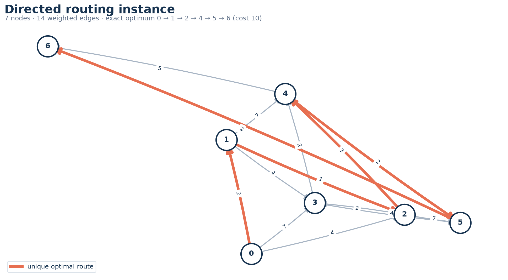
</p>

| Property | Value |
|---|---:|
| Nodes / directed edges | 7 / 14 |
| Binary states | $2^{14}=16{,}384$ |
| Decoder-valid routes | 20 |
| Unique optimal route | `0 → 1 → 2 → 4 → 5 → 6` |
| Optimal route cost | **10** |
| QAOA depths studied | $p=1,\ldots,110$ |

## QUBO energy landscape

The routing cost and flow penalty assign an exact energy $Q(x)$ to every one
of the 16,384 computational-basis states. With $A=6$, the complete energy
range is 10–207; the 20 decoder-valid routes are highlighted in cyan and the
unique optimum is marked with a gold star.

<p align="center">
  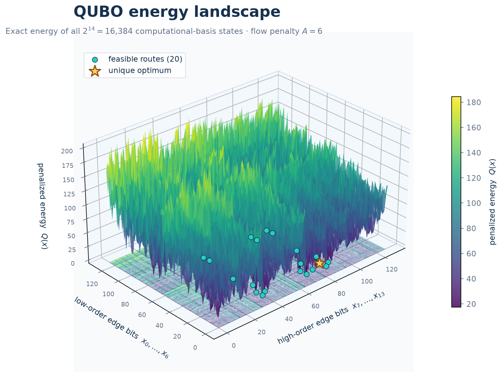
</p>

The two horizontal coordinates split the 14-bit basis index into two 7-bit
blocks only for visualization. The vertical values are the exact, unsmoothed
QUBO energies; the connecting surface does not imply a continuous search
space.

## Results

The plots below use the frozen depth sweep in
[`results/global_depth110/depth_by_depth.csv`](./results/global_depth110/depth_by_depth.csv).
Both methods use the same 14-qubit Hamiltonian, initialization policy,
continuation scheme, and depth-dependent COBYLA evaluation budget.

<p align="center">
  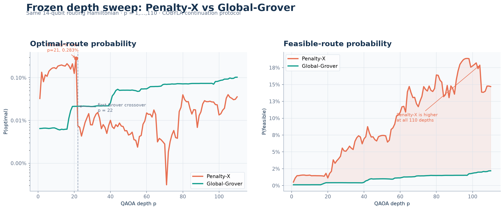
</p>

### Depth-110 comparison

| Method | $P(\mathrm{feasible})$ | $P(\mathrm{optimal})$ | $P(\mathrm{optimal}\mid\mathrm{feasible})$ | $\langle H_C\rangle$ | Evaluations |
|---|---:|---:|---:|---:|---:|
| Penalty-X | **14.6970%** | 0.035787% | 0.24350% | **18.3693** | 504 |
| Global-Grover | 2.19461% | **0.102978%** | **4.69233%** | 33.2746 | 504 |

### Main observations

- **Penalty-X favors feasibility.** It places more probability on valid routes
  at every one of the 110 recorded depths.
- **Global-Grover favors concentration within the feasible subspace.** It has
  the higher conditional optimal probability at 89 of 110 depths.
- The first raw-success crossover occurs at **$p=22$**. Global-Grover has the
  higher $P(\mathrm{optimal})$ for every recorded depth from 22 through 110.
- The largest success probability in the complete sweep is nevertheless the
  Penalty-X result at **$p=21$**, where
  $P(\mathrm{optimal})=0.283315\%$. Global-Grover reaches its maximum at
  **$p=110$**, with $P(\mathrm{optimal})=0.102978\%$.

These results reveal two different bottlenecks: Penalty-X is better at moving
mass into the valid routing subspace, while Global-Grover is better at selecting
the optimum after feasibility is reached.

> [!NOTE]
> The frozen optimizer runs are evaluation-budget limited. The reported points
> are reproducible outcomes of this protocol, not certificates of globally
> optimal QAOA parameters.

## Complete notebook result report

This section records the outputs of a fresh end-to-end execution of the full
notebook, in notebook order. All 25 generated figures are shown below. The
complete 16,384-row basis-state table is also available as
[`04_all_basis_state_energies.csv`](./results/notebook/04_all_basis_state_energies.csv),
so the numerical landscape can be inspected without rerunning the simulation.

### 1. Graph, edge encoding, and exact solution

<p align="center">
  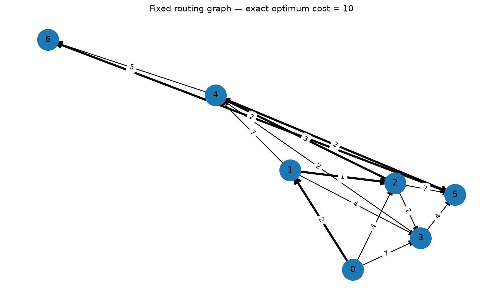
</p>

Each edge is one binary variable and one qubit. Bitstrings throughout this
report use the order `q0 → q13`.

| Qubit | Directed edge | Weight | Qubit | Directed edge | Weight |
|---:|:---:|---:|---:|:---:|---:|
| `q0` | `0 → 1` | 2 | `q7` | `2 → 4` | 3 |
| `q1` | `0 → 2` | 4 | `q8` | `2 → 5` | 7 |
| `q2` | `0 → 3` | 7 | `q9` | `3 → 4` | 2 |
| `q3` | `1 → 2` | 1 | `q10` | `3 → 5` | 4 |
| `q4` | `1 → 3` | 4 | `q11` | `4 → 5` | 2 |
| `q5` | `1 → 4` | 7 | `q12` | `4 → 6` | 5 |
| `q6` | `2 → 3` | 2 | `q13` | `5 → 6` | 2 |

| Exact result | Value |
|---|---|
| Source / target | `0 / 6` |
| Optimal route | `0 → 1 → 2 → 4 → 5 → 6` |
| Optimal bitstring (`q0 → q13`) | `10010001000101` |
| Optimal cost | **10** |

<details>
<summary><strong>All 20 decoder-valid routes</strong></summary>

| Bitstring (`q0 → q13`) | Route | Cost |
|---|---|---:|
| `10000100000010` | `0 → 1 → 4 → 6` | 14 |
| `01000001000010` | `0 → 2 → 4 → 6` | 12 |
| `10010001000010` | `0 → 1 → 2 → 4 → 6` | 11 |
| `00100000010010` | `0 → 3 → 4 → 6` | 14 |
| `10001000010010` | `0 → 1 → 3 → 4 → 6` | 13 |
| `01000010010010` | `0 → 2 → 3 → 4 → 6` | 13 |
| `10010010010010` | `0 → 1 → 2 → 3 → 4 → 6` | 12 |
| `01000000100001` | `0 → 2 → 5 → 6` | 13 |
| `10010000100001` | `0 → 1 → 2 → 5 → 6` | 12 |
| `00100000001001` | `0 → 3 → 5 → 6` | 13 |
| `10001000001001` | `0 → 1 → 3 → 5 → 6` | 12 |
| `01000010001001` | `0 → 2 → 3 → 5 → 6` | 12 |
| `10010010001001` | `0 → 1 → 2 → 3 → 5 → 6` | 11 |
| `10000100000101` | `0 → 1 → 4 → 5 → 6` | 13 |
| `01000001000101` | `0 → 2 → 4 → 5 → 6` | 11 |
| **`10010001000101`** | **`0 → 1 → 2 → 4 → 5 → 6`** | **10** |
| `00100000010101` | `0 → 3 → 4 → 5 → 6` | 13 |
| `10001000010101` | `0 → 1 → 3 → 4 → 5 → 6` | 12 |
| `01000010010101` | `0 → 2 → 3 → 4 → 5 → 6` | 12 |
| `10010010010101` | `0 → 1 → 2 → 3 → 4 → 5 → 6` | 11 |

</details>

### 2. Complete QUBO and Ising landscape

| Quantity | Executed result |
|---|---:|
| Penalty coefficient $A$ | 6 |
| QUBO constant | 12 |
| Ising constant $c_0$ | 86 |
| Enumerated basis states | 16,384 |
| Feasible / optimal states | 20 / 1 |
| Minimum / maximum energy | 10 / 207 |
| Maximum QUBO–Ising disagreement | **0** |

<table>
  <tr>
    <td width="50%" align="center">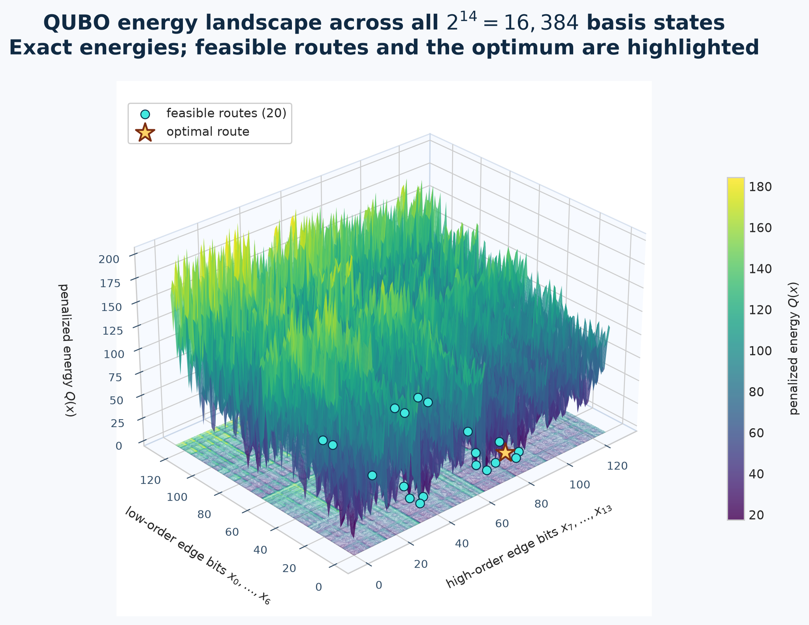<br><sub>Exact energy of every basis state</sub></td>
    <td width="50%" align="center">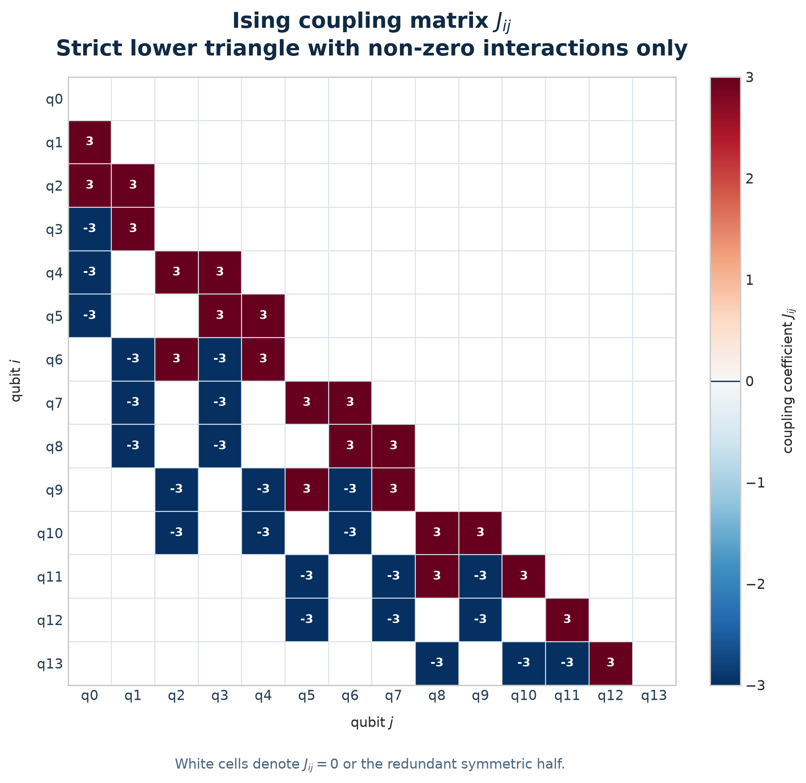<br><sub>Ising two-qubit coupling matrix</sub></td>
  </tr>
</table>

The energy plot is an exact enumeration, not a sample. Cyan points are the 20
valid routes and the gold star is the unique cost-10 optimum. Download the
[complete state table](./results/notebook/04_all_basis_state_energies.csv) for
the basis index, both bit-order conventions, QUBO energy, routing cost, flow
penalty, feasibility flag, optimality flag, and decoded route of every state.

<details>
<summary><strong>QUBO linear coefficients and all pair-coupling groups</strong></summary>

| Variable | `q0` | `q1` | `q2` | `q3` | `q4` | `q5` | `q6` | `q7` | `q8` | `q9` | `q10` | `q11` | `q12` | `q13` |
|---|---:|---:|---:|---:|---:|---:|---:|---:|---:|---:|---:|---:|---:|---:|
| Linear coefficient | 2 | 4 | 7 | 13 | 16 | 19 | 14 | 15 | 19 | 14 | 16 | 14 | 5 | 2 |

All nonzero pair coefficients have magnitude 12:

- **+12:** `(q0,q1)`, `(q0,q2)`, `(q1,q2)`, `(q1,q3)`, `(q2,q4)`,
  `(q2,q6)`, `(q3,q4)`, `(q3,q5)`, `(q4,q5)`, `(q4,q6)`, `(q5,q7)`,
  `(q5,q9)`, `(q6,q7)`, `(q6,q8)`, `(q7,q8)`, `(q7,q9)`, `(q8,q10)`,
  `(q8,q11)`, `(q9,q10)`, `(q10,q11)`, `(q11,q12)`, `(q11,q13)`,
  `(q12,q13)`.
- **−12:** `(q0,q3)`, `(q0,q4)`, `(q0,q5)`, `(q1,q6)`, `(q1,q7)`,
  `(q1,q8)`, `(q2,q9)`, `(q2,q10)`, `(q3,q6)`, `(q3,q7)`, `(q3,q8)`,
  `(q4,q9)`, `(q4,q10)`, `(q5,q11)`, `(q5,q12)`, `(q6,q9)`,
  `(q6,q10)`, `(q7,q11)`, `(q7,q12)`, `(q8,q13)`, `(q9,q11)`,
  `(q9,q12)`, `(q10,q13)`.

</details>

<details>
<summary><strong>Ising local fields</strong></summary>

| Term | `Z0` | `Z1` | `Z2` | `Z3` | `Z4` | `Z5` | `Z6` | `Z7` | `Z8` | `Z9` | `Z10` | `Z11` | `Z12` | `Z13` |
|---|---:|---:|---:|---:|---:|---:|---:|---:|---:|---:|---:|---:|---:|---:|
| $h_i$ | 2 | −2 | −9.5 | −3.5 | −11 | −12.5 | −7 | −7.5 | −12.5 | −1 | −5 | −4 | 0.5 | 5 |

</details>

### 3. QAOA operators and one-layer mechanism

<table>
  <tr>
    <td width="50%" align="center">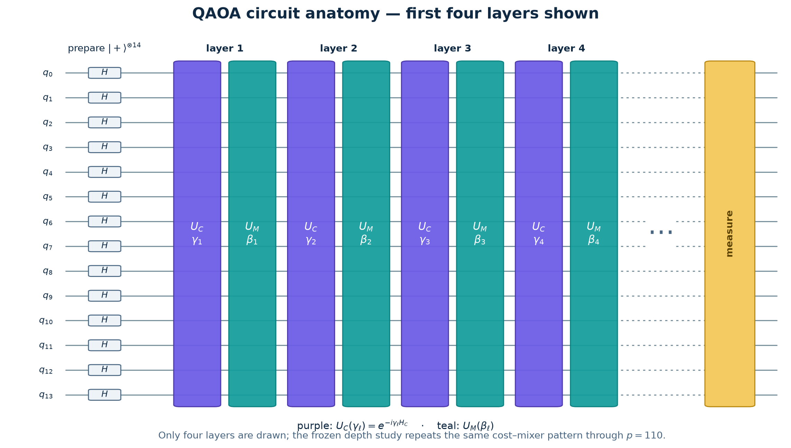<br><sub>Four-layer circuit structure</sub></td>
    <td width="50%" align="center">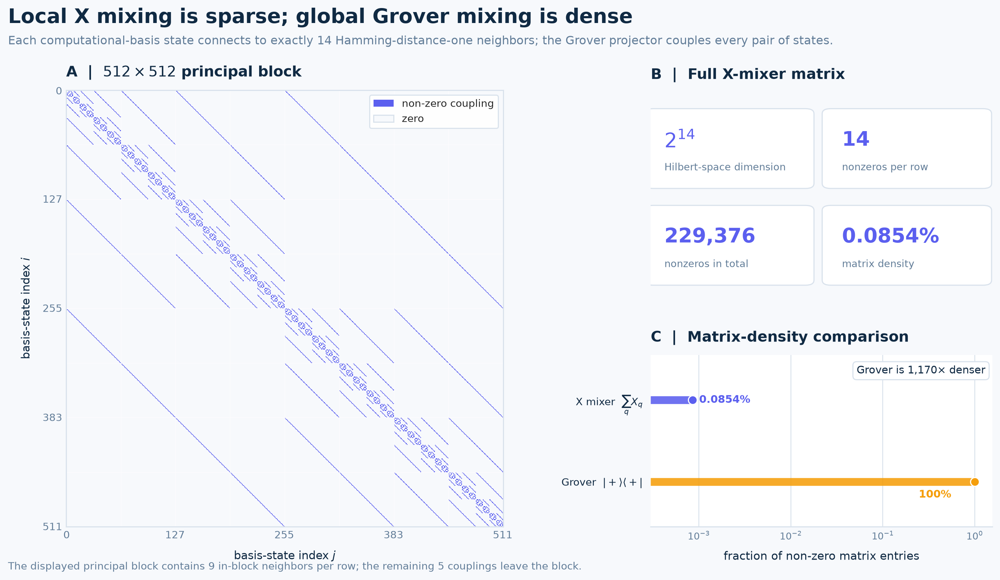<br><sub>Exact sparsity pattern of the 14-qubit X mixer</sub></td>
  </tr>
</table>

| Operator diagnostic | Result |
|---|---:|
| X-mixer matrix shape | $16{,}384\times16{,}384$ |
| X-mixer nonzero entries | 229,376 |
| X-mixer density | 0.0008544921875 |
| Grover projector entry | $1/16{,}384=0.00006103515625$ |

The first image below shows the cost Hamiltonian converting energy differences
into phases. The next two show how the mixers then convert phase structure into
probability redistribution.

<table>
  <tr>
    <td width="33%" align="center">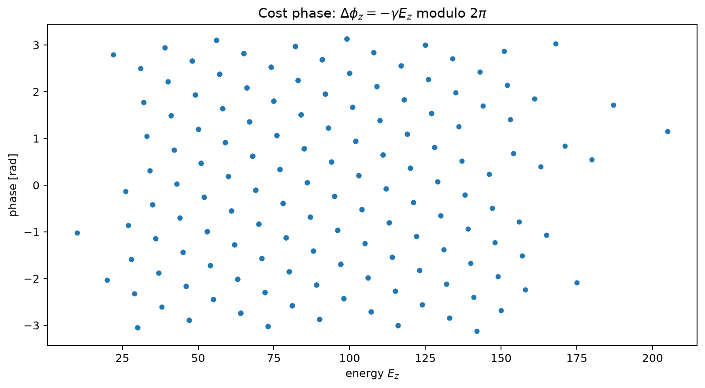<br><sub>Energy → phase</sub></td>
    <td width="33%" align="center">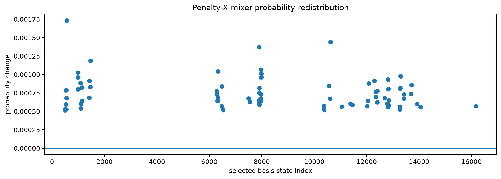<br><sub>Penalty-X redistribution</sub></td>
    <td width="33%" align="center">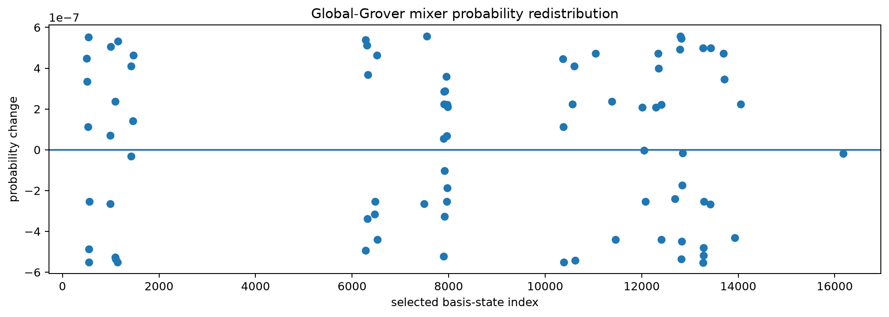<br><sub>Global-Grover redistribution</sub></td>
  </tr>
</table>

| One-layer check | Maximum probability change |
|---|---:|
| Cost phase | $2.710505\times10^{-20}$ |
| X mixer | $1.733195\times10^{-3}$ |
| Grover mixer | $5.562657\times10^{-7}$ |

This numerically confirms the intended mechanism: a diagonal cost unitary
changes phases but not basis probabilities; probability changes occur at the
mixer step.

### 4. Live one-layer COBYLA example

<table>
  <tr>
    <td width="50%" align="center">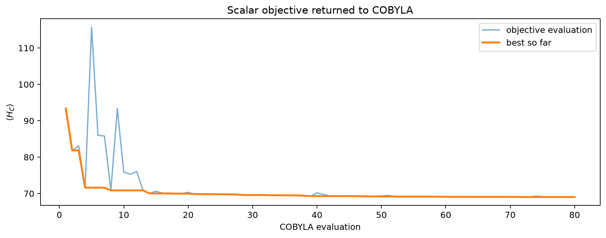<br><sub>Best-so-far penalized objective</sub></td>
    <td width="50%" align="center">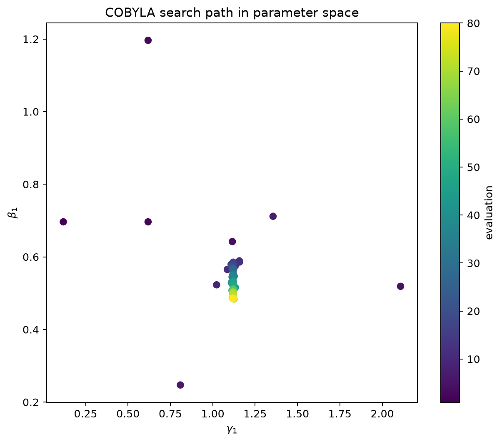<br><sub>Search path in $(\gamma,\beta)$ space</sub></td>
  </tr>
</table>

The notebook runs this small optimization live to expose the optimizer's
behavior before loading the frozen depth sweep. Its first five evaluations are:

| Evaluation | $\gamma$ | $\beta$ | Objective | Best so far | $P_\mathrm{feas}$ | $P_\mathrm{opt}$ |
|---:|---:|---:|---:|---:|---:|---:|
| 1 | 0.118398 | 0.696465 | 93.362007 | 93.362007 | 0.000492 | $3.221988\times10^{-5}$ |
| 2 | 0.618398 | 0.696465 | 81.842923 | 81.842923 | 0.000885 | $1.738526\times10^{-4}$ |
| 3 | 0.618398 | 1.196465 | 83.103093 | 81.842923 | 0.000479 | $3.072291\times10^{-5}$ |
| 4 | 1.115433 | 0.642090 | 71.618250 | 71.618250 | 0.002303 | $1.123022\times10^{-4}$ |
| 5 | 2.107810 | 0.518855 | 115.695374 | 71.618250 | 0.000008 | $4.979591\times10^{-8}$ |

### 5. Frozen depth sweep: $p=1,\ldots,110$

These four plots contain the original single-metric notebook outputs behind the
combined summary chart near the top of this page.

<table>
  <tr>
    <td width="50%" align="center">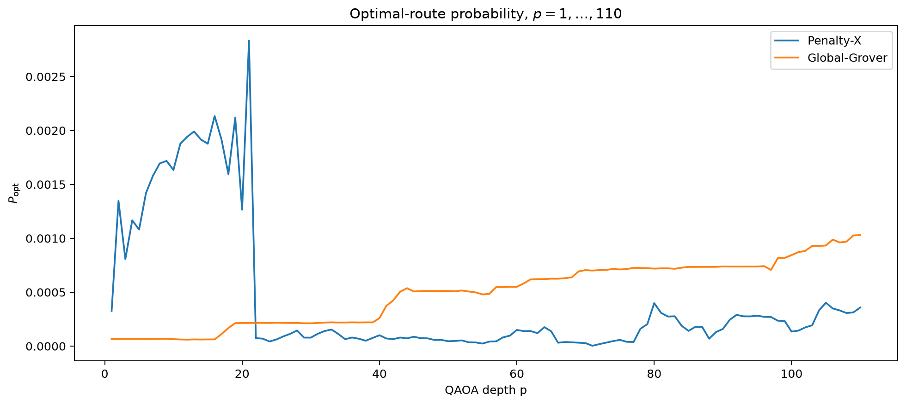<br><sub>Raw optimal-state probability</sub></td>
    <td width="50%" align="center">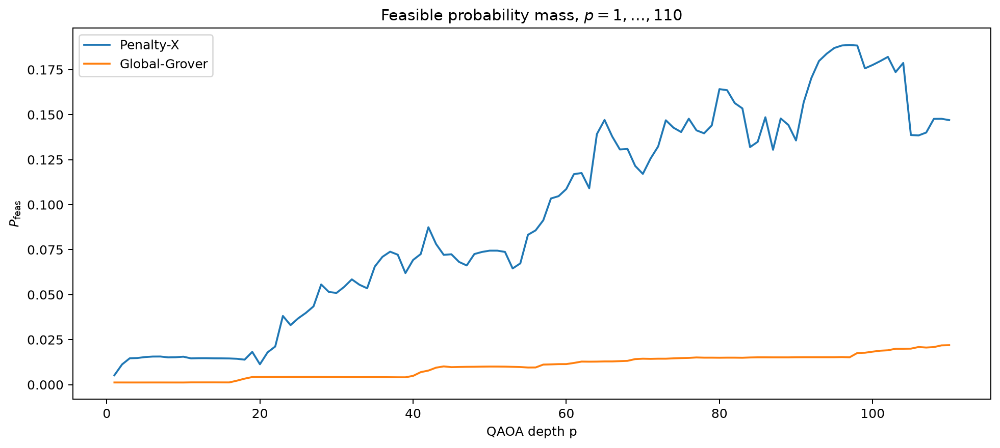<br><sub>Total feasible probability</sub></td>
  </tr>
  <tr>
    <td width="50%" align="center">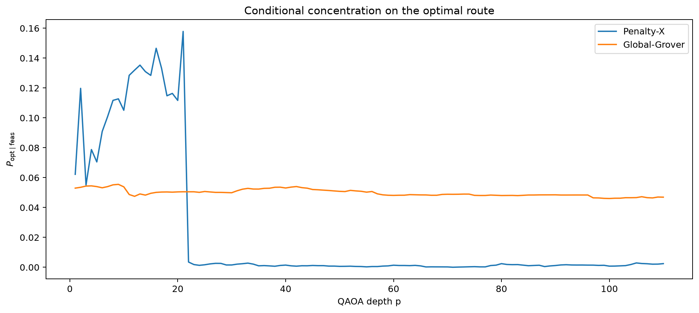<br><sub>Optimal probability conditioned on feasibility</sub></td>
    <td width="50%" align="center">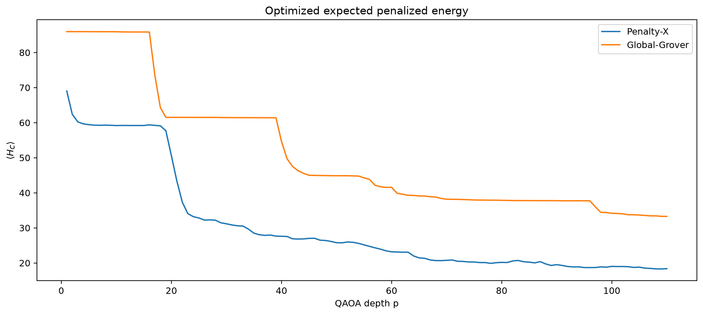<br><sub>Expected penalized cost</sub></td>
  </tr>
</table>

| Sweep result | Penalty-X | Global-Grover |
|---|---:|---:|
| Best $P_\mathrm{opt}$ | **0.002833154 at $p=21$** | 0.001029783 at $p=110$ |
| Depths with higher $P_\mathrm{feas}$ | **110 / 110** | 0 / 110 |
| Depths with higher $P(\mathrm{opt}\mid\mathrm{feas})$ | 21 / 110 | **89 / 110** |
| First raw-success crossover | — | **$p=22$** |

Every frozen row, including both methods' metrics, evaluation counts, and
termination status, is stored in
[`depth_by_depth.csv`](./results/global_depth110/depth_by_depth.csv).

### 6. Depth-110 replay and layer-by-layer dynamics

The saved 220-parameter solutions were replayed exactly. Both optimizers used
504 function evaluations and ended because their evaluation budgets were
exhausted.

| Replay metric | Penalty-X | Global-Grover |
|---|---:|---:|
| $\langle H_C\rangle$ | 18.3692546800824 | 33.2745946477395 |
| $P_\mathrm{feas}$ | 0.146970227261605 | 0.0219460980572833 |
| $P_\mathrm{opt}$ | 0.000357867139229732 | 0.00102978342271465 |
| $P(\mathrm{opt}\mid\mathrm{feas})$ | 0.002434963501776 | 0.0469233036335992 |
| Largest metric replay error | $3.45\times10^{-13}$ | $7.11\times10^{-15}$ |
| Largest cost-step probability change | $1.11\times10^{-16}$ | $8.67\times10^{-19}$ |
| Replay verdict | **PASS** | **PASS** |

<table>
  <tr>
    <td width="50%" align="center">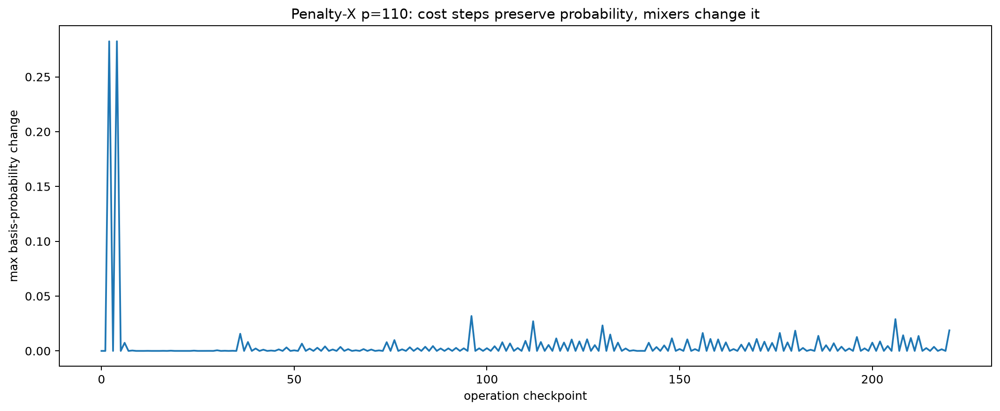<br><sub>Penalty-X: cost vs. mixer probability change</sub></td>
    <td width="50%" align="center">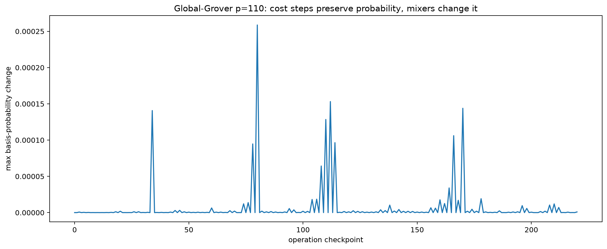<br><sub>Global-Grover: cost vs. mixer probability change</sub></td>
  </tr>
</table>

<table>
  <tr>
    <td width="50%" align="center">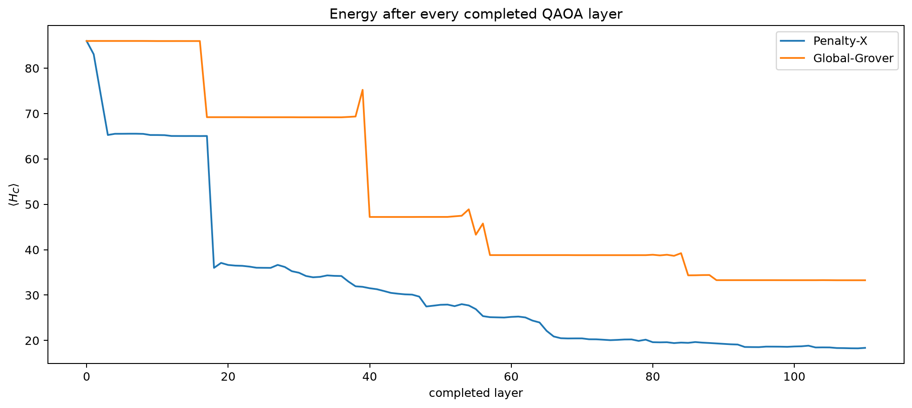<br><sub>Expected energy after each completed layer</sub></td>
    <td width="50%" align="center">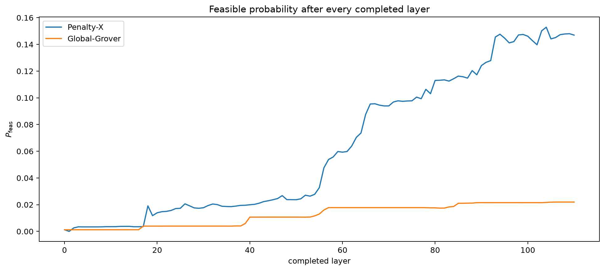<br><sub>Feasible probability after each completed layer</sub></td>
  </tr>
  <tr>
    <td width="50%" align="center">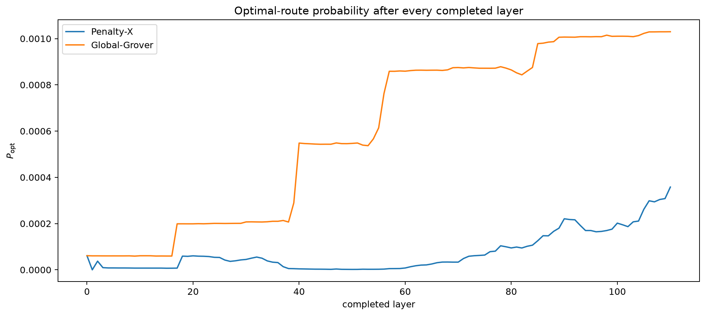<br><sub>Optimal probability after each completed layer</sub></td>
    <td width="50%" align="center">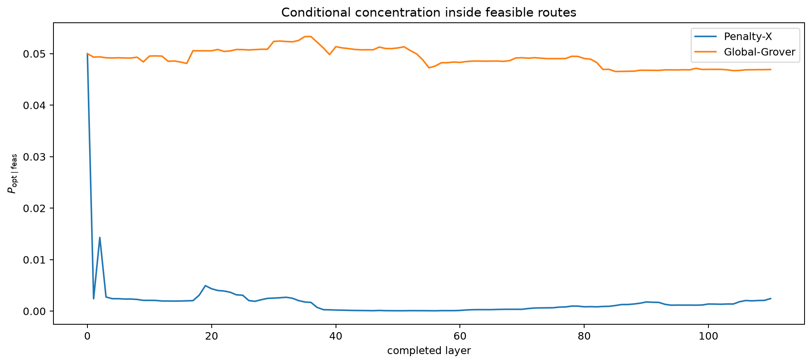<br><sub>Conditional optimal probability after each layer</sub></td>
  </tr>
</table>

<p align="center">
  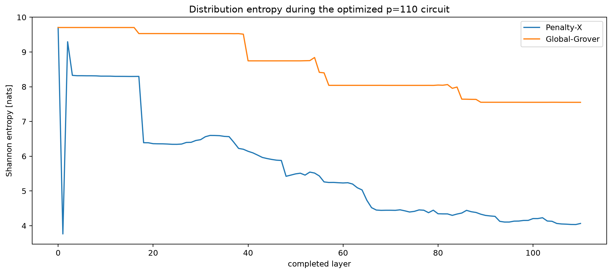<br>
  <sub>Shannon entropy of the basis-state probability distribution</sub>
</p>

<table>
  <tr>
    <td width="50%" align="center">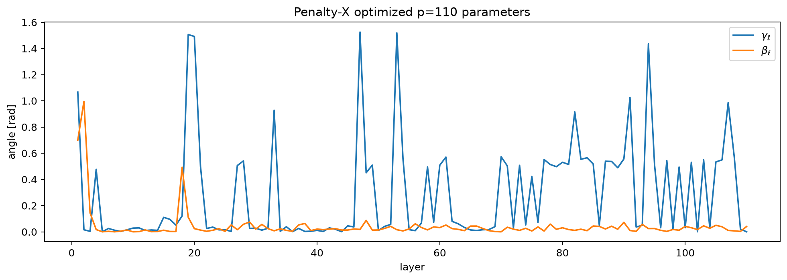<br><sub>Penalty-X optimized parameters</sub></td>
    <td width="50%" align="center">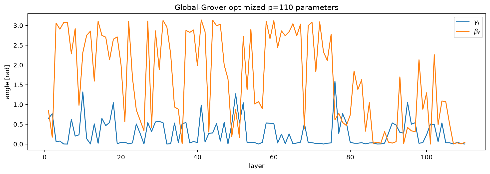<br><sub>Global-Grover optimized parameters</sub></td>
  </tr>
</table>

The final two views place the energy trajectories in depth/layer coordinates.
The heat map compares both methods; the 3-D view exposes the Penalty-X energy
surface across the continuation sweep.

<table>
  <tr>
    <td width="50%" align="center">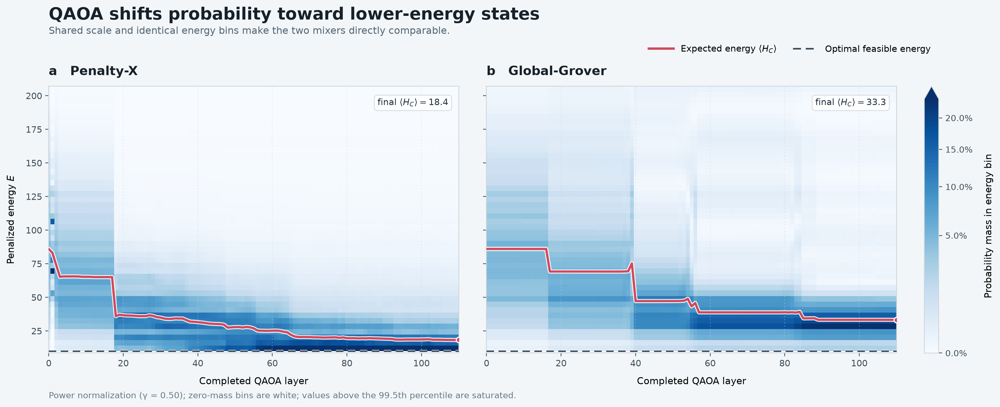<br><sub>Energy–depth comparison</sub></td>
    <td width="50%" align="center">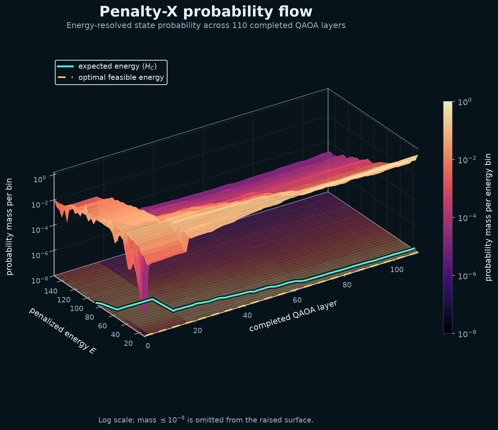<br><sub>Penalty-X energy–depth surface</sub></td>
  </tr>
</table>

### 7. Final-state interpretation

At $p=110$, Global-Grover allocates less total mass to feasible routes but
concentrates that mass much more strongly on the optimum:

$$
P_\mathrm{opt}=P_\mathrm{feas}\,
P(\mathrm{opt}\mid\mathrm{feas}).
$$

| Method | $P_\mathrm{feas}$ | $P(\mathrm{opt}\mid\mathrm{feas})$ | Product = $P_\mathrm{opt}$ |
|---|---:|---:|---:|
| Penalty-X | 0.146970 | 0.002435 | 0.000358 |
| Global-Grover | 0.021946 | 0.046923 | 0.001030 |

<details>
<summary><strong>Top 15 final basis states for each mixer</strong></summary>

Penalty-X:

| Rank | Bitstring | Probability | Valid route / reason |
|---:|---|---:|---|
| 1 | `00000000000000` | 0.271094 | flow constraints violated |
| 2 | `00000000000001` | 0.071269 | flow constraints violated |
| 3 | `10000000000000` | 0.055934 | flow constraints violated |
| 4 | `00000000000010` | 0.046130 | flow constraints violated |
| 5 | `00100000010010` | 0.031323 | `0 → 3 → 4 → 6`, cost 14 |
| 6 | `00100000000000` | 0.029585 | flow constraints violated |
| 7 | `10000100000010` | 0.026741 | `0 → 1 → 4 → 6`, cost 14 |
| 8 | `00100000001001` | 0.022570 | `0 → 3 → 5 → 6`, cost 13 |
| 9 | `01000000000000` | 0.020505 | flow constraints violated |
| 10 | `10000000000001` | 0.016296 | flow constraints violated |
| 11 | `00000000000101` | 0.013054 | flow constraints violated |
| 12 | `00000000010010` | 0.012275 | flow constraints violated |
| 13 | `10001000001001` | 0.011947 | `0 → 1 → 3 → 5 → 6`, cost 12 |
| 14 | `01000000000001` | 0.011243 | flow constraints violated |
| 15 | `10010000000000` | 0.011222 | flow constraints violated |

Global-Grover's top 15 states are tied to the shown precision
($P=0.001296$ each); all 15 violate the flow constraints:

`10000100000000`, `00100000010000`, `10010010001000`,
`01000001000100`, `10010010010100`, `01000000000010`,
`00010001000010`, `10000000010010`, `00000010010010`,
`00100000000001`, `01000001000001`, `00000000100001`,
`10010010010001`, `10010000001001`, `00010010001001`.

</details>

### 8. Validation and frozen runtime

| Validation check | Value | Pass |
|---|---:|:---:|
| Exact path cost | 10 | ✅ |
| Feasible states | 20 | ✅ |
| Optimal states | 1 | ✅ |
| QUBO–Ising maximum error | 0 | ✅ |
| Uniform-state norm | 1 | ✅ |
| Cost probability invariant | $2.710505\times10^{-20}$ | ✅ |
| Penalty-X $p=110$ replay $P_\mathrm{opt}$ error | $4.770490\times10^{-18}$ | ✅ |
| Grover $p=110$ replay $P_\mathrm{opt}$ error | $1.301043\times10^{-18}$ | ✅ |

```text
ALL VALIDATIONS PASS
```

| Method | Optimizer time | Total time | Evaluations | Termination |
|---|---:|---:|---:|---|
| Penalty-X | 63.541318 s | 63.798645 s | 504 | `EVALUATION_BUDGET_EXHAUSTED` |
| Global-Grover | 12.659797 s | 12.682865 s | 504 | `EVALUATION_BUDGET_EXHAUSTED` |

The runtime table describes the frozen parameter-generation runs stored in the
checkpoints; it is not the wall time of the lightweight replay performed by the
default notebook execution.

## Reproduce the notebook

Python 3.11–3.13 is supported.

```bash
git clone https://github.com/ZhilinChen02/sciqis-qaoa-routing.git
cd sciqis-qaoa-routing
python -m venv .venv
source .venv/bin/activate
python -m pip install -e ".[notebook]"
python -m jupyter lab QAOA_Routing_Project_Full_Reproduction.ipynb
```

For a non-interactive end-to-end run:

```bash
MPLBACKEND=Agg python -m jupyter nbconvert \
  --to notebook --execute QAOA_Routing_Project_Full_Reproduction.ipynb \
  --output /tmp/QAOA_Routing_Project_Full_Reproduction.executed.ipynb \
  --ExecutePreprocessor.kernel_name=python3 \
  --ExecutePreprocessor.timeout=300
```

A successful run executes all 51 cells and finishes with:

```text
ALL VALIDATIONS PASS
```

The default execution replays the saved depth-110 parameters and normally
finishes in under two minutes. The optional full depth-1-to-110 re-optimization
is disabled by default because it is substantially more expensive.

## What is validated

The notebook checks the scientific-computing chain directly:

- QUBO, Ising, and penalized routing energies agree on all 16,384 basis states;
- exactly 20 states decode as valid routes and exactly one is optimal;
- cost evolution preserves computational-basis probabilities;
- both mixer implementations preserve state normalization;
- saved Penalty-X and Global-Grover depth-110 metrics are reproduced within
  numerical tolerance;
- the final validation table passes every assertion.

## Repository layout

```text
.
├── QAOA_Routing_Project_Full_Reproduction.ipynb
├── assets/
│   ├── readme/                     # three curated overview figures
│   └── notebook-results/           # all 25 notebook result figures
├── data/graph.json                 # fixed routing instance
├── results/global_depth110/
│   ├── depth_by_depth.csv          # p = 1,…,110 summary
│   └── checkpoints/                # two p = 110 parameter sets
├── results/notebook/
│   └── 04_all_basis_state_energies.csv
├── src/
│   ├── graph.py                    # graph and route encoding
│   ├── qubo.py                     # QUBO/Ising construction
│   ├── qaoa.py                     # exact statevector evolution
│   └── metrics.py                  # route-distribution metrics
└── pyproject.toml
```

Figures and tables generated during a local notebook run are written to
`notebook_output/qaoa_project_reproduction/` and ignored by Git. This repository
versions the three overview figures, the 25 complete-report figures, and the
full basis-state energy table used on this page.
