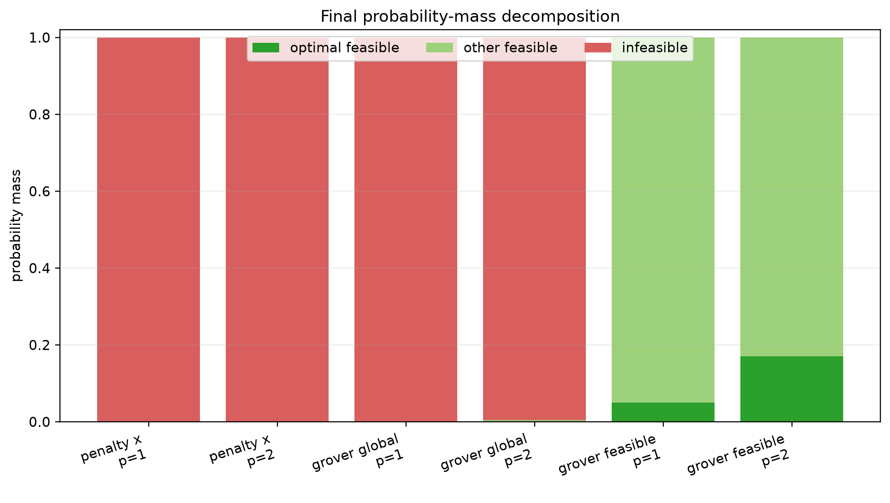
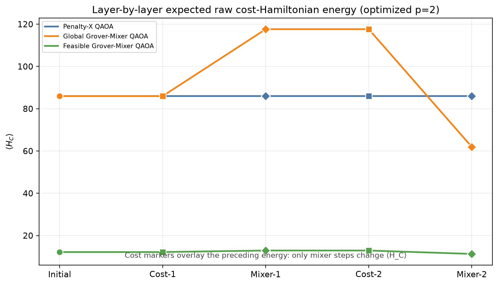

# QAOA Routing — DTU SCIQIS Course Project

## Project question

This project studies how QAOA encodes and samples routes in a small weighted
directed graph. The primary dynamics study holds the routing problem fixed and
compares three quantum search geometries:

1. **Penalty-X QAOA:** all edge bitstrings with local Hamming-neighbor mixing;
2. **Global Grover-Mixer QAOA:** the same full bitstring space and byte-identical
   Penalty-QUBO, with a rank-one global projector mixer;
3. **Feasible Grover-Mixer QAOA:** the 20-route logical feasible basis with the
   existing rank-one feasible projector mixer.

> The cost Hamiltonian encodes objective information into relative phases; the
> mixer converts those phase differences into interference and probability
> redistribution.

The central question is how search-space restriction and mixer geometry change
probability flow, feasibility, optimality, and energy in shallow p=1/p=2 QAOA.
This teaching-scale ideal-simulation project does not claim quantum advantage
or superiority over classical shortest-path algorithms.

## Primary p=1/p=2 dynamics result

All six cells use COBYLA, seed 2601, at most 100 objective evaluations, and the
existing grouped parameter convention. The two full-space methods use exactly
the same normalized Penalty-QUBO diagonal and the same uniform initial state.

| Method | p | search dimension | p_feas | p_opt | invalid mass | raw `<H_C>` | `E[C|feasible]` | evals | optimize s |
|---|---:|---:|---:|---:|---:|---:|---:|---:|---:|
| Penalty-X | 1 | 16,384 | 0.00122070 | 0.00006104 | 0.99877930 | 86.0000 | 12.2000 | 50 | 1.206 |
| Penalty-X | 2 | 16,384 | 0.00122070 | 0.00006104 | 0.99877930 | 86.0000 | 12.2000 | 73 | 1.566 |
| Global-Grover | 1 | 16,384 | 0.00122070 | 0.00006104 | 0.99877930 | 86.0000 | 12.2000 | 32 | 0.224 |
| Global-Grover | 2 | 16,384 | 0.00417370 | 0.00021337 | 0.99582630 | 61.9427 | 12.1891 | 100 | 1.088 |
| Feasible-Grover | 1 | 20 | 1.00000000 | 0.05000000 | 0 | 12.2000 | 12.2000 | 23 | 0.050 |
| Feasible-Grover | 2 | 20 | 1.00000000 | 0.17092702 | 0 | 11.3066 | 11.3066 | 100 | 0.181 |

The full-space initial baseline is `p_opt=1/16,384`; the feasible-basis
baseline is `p_opt=1/20`. The p=1 optimizer retained these baselines under the
fixed single-start protocol. This is reported as observed rather than repaired
with post-hoc solver-specific tuning.





The complete explanation, layer traces, phase plots, energy landscape, and
limitations are in [the dynamics deep dive](docs/QAOA_DYNAMICS_DEEP_DIVE.md).

## Depth 1–110 route-cost comparison

The extended main track compares Penalty-X with a feasible-subspace
Grover-Mixer using the route-cost phase

\[
U_C(\gamma)|P_i\rangle=e^{-i\gamma C(P_i)}|P_i\rangle
\]

at every depth from `p=1` to `p=110`. This is distinct from the historical
incumbent-threshold phase described below: the threshold mask is used only for
the auxiliary BSP metric in this comparison.

Under the frozen single-seed COBYLA protocol, the route-cost Grover-Mixer first
reaches `p_opt >= 0.50`, `0.90`, and `0.99` at depths 58, 69, and 88. Its best
saved result is `p_opt=0.999846` at `p=110`. Penalty-X does not overtake it at
any saved depth. Under the project-plan definition, the first Grover-over-
Penalty crossover is `p=1`. The observed saturation-criterion onsets are `p=2`
for Penalty-X and `p=92` for the Grover-Mixer, using ten consecutive changes
below `1e-3`. The Penalty-X onset means that no measurable early improvement
was observed under the frozen budget; it is not evidence of convergence at
`p=2`.


The [Depth-110 report](results/depth110_ext/v2/REPORT.md) contains the complete
220-row protocol, all three figures, validation details, and limitations.
`BUDGET_LIMITED` means that the frozen function-evaluation cap was reached; it
does not mean that the process crashed or exceeded a wall-clock limit.

## Core pipeline

```text
weighted graph
    -> edge variables
    -> flow-constrained QUBO
    -> Ising Hamiltonian
    -> Penalty-X QAOA
    -> statevector measurement probabilities
    -> route decoding and p_feas / p_opt
```

The fixed graph has 7 nodes and 14 directed weighted edges. Flow conservation
is enforced with penalty `A=6`. Independent shortest-path and exhaustive
simple-route calculations agree on the unique cost-10 reference route:

```text
0 -> 1 -> 2 -> 4 -> 5 -> 6
```

The reference is used to evaluate `p_opt`; it does not enter QAOA parameter
optimization.

## Preserved feasible-threshold extension

The edge representation has

```text
2^14 = 16,384 computational states.
```

The logical feasible representation classically enumerates the actual

```text
20 valid simple source-to-target routes.
```

Every logical coordinate is therefore feasible. The uniform logical initial
state has `p_feas=1` structurally and places `1/20 = 5%` probability on each
route.

The deterministic greedy incumbent is

```text
0 -> 1 -> 2 -> 3 -> 4 -> 5 -> 6, cost 11.
```

The final threshold is constructed without an optimum label:

```text
marked(P) = 1 when raw_cost(P) < incumbent_cost = 11.
```

Exactly one of the 20 routes satisfies this threshold on the course instance.
Only after threshold construction is that route compared with the classical
reference for reporting `p_opt`.

GM-Th-QAOA starts in the uniform feasible state, applies the Boolean threshold
phase, and mixes with the rank-one Grover feasible mixer

\[
U_G(\beta)=e^{-i\beta|F\rangle\langle F|}
=I+(e^{-i\beta}-1)|F\rangle\langle F|.
\]

The evolution never leaves the 20-dimensional feasible basis.

## Historical feasible-threshold results

The immutable three-seed descriptive study gives:

| Configuration | Median p_opt | p_feas |
|---|---:|---:|
| Uniform feasible initialization | 5.00% | ≈100% |
| GM-Th-QAOA p=1 | 39.20% | ≈100% |
| GM-Th-QAOA p=2 | 81.608% | ≈100% |
| GM-Th-QAOA p=3 | **99.8712%** | ≈100% |

This behavior is similar to amplitude amplification: alternating selective
phases and global feasible-space mixing concentrates mass on the marked set.
It is an instance-specific mechanism demonstration, not a scaling result.

## Limitations

- All feasible routes are enumerated classically before logical simulation.
- The logical Hilbert space has only 20 states.
- Exactly one route lies below the incumbent threshold on this instance.
- Structural `p_feas=1` is not empirical quantum advantage.
- This is not a scalable routing algorithm or hardware implementation.
- No quantum-advantage or statistical-significance claim is made.
- The shortest-path problem itself is not claimed to be NP-hard.

## Installation

Python 3.11–3.13 is supported.

```bash
python -m pip install -e ".[dev]"
```

## Quick start

Run the complete three-geometry dynamics experiment in its isolated result and
figure namespaces:

```bash
python scripts/run_qaoa_dynamics_deep_dive.py
```

The command refuses to overwrite a non-empty result namespace. Regenerate all
17 dynamics figures from the saved tables without rerunning optimization:

```bash
python scripts/make_qaoa_dynamics_figures.py
```

Run the final three-seed course method. It prints results and does not write to
the immutable result roots:

```bash
python scripts/run_course_final.py
```

Optional development overrides are explicit:

```bash
python scripts/run_course_final.py --seed 2601 --depth 3 --output /tmp/q2f-smoke.json
```

Run the readable Penalty-X course core:

```bash
python scripts/run_penalty_qaoa.py
```

## Interactive QAOA circuit replay

Replay the retained optimizer trajectories in a local browser interface:

```bash
python scripts/run_qaoa_visualizer.py
```

The visualizer contains all three final algorithms at depths `p=1..4` and all
three retained seeds. It animates the phase and mixer operations while showing
the current `gamma`, `beta`, expected route cost, optimizer loss, better-solution
probability, and the probability distribution over all 20 feasible routes.

The interface reads the sealed result files without modifying them. Its
gate-by-gate state reconstruction is the exact 20-dimensional logical model;
it is deliberately labelled as an operator circuit rather than a hardware gate
decomposition. Use `--no-browser` when starting it on a remote machine, or
`--check` to validate the visualization inputs without starting the server.

## Interactive QAOA Dynamics Demo

Launch the complete saved-data-driven physics dashboard:

```bash
python scripts/run_qaoa_dynamics_visualizer.py
```

The unified demo supports Penalty-X, Global-Grover, and Feasible-Grover at
`p=1` and `p=2`. Its synchronized checkpoint slider advances the circuit,
expected-energy decomposition, exact `p_feas`/`p_opt`/invalid probability mass,
top-state probability flow, complex amplitudes, phase-versus-energy scatter,
all-state energy histogram, conceptual mixer geometry, original routing graph,
and saved `p=1` parameter landscapes. Autoplay and a seven-scene presentation
mode are built in.

The server reads `results/qaoa_dynamics_deep_dive/v1/`, never reruns the
optimizer, and checks reconstructed statevectors against the saved traces before
serving the interface. Cost checkpoints visibly rotate phases while preserving
basis probabilities and `⟨H_C⟩`; mixer checkpoints show the resulting
interference and probability redistribution.

Validate without launching a server using:

```bash
python scripts/run_qaoa_dynamics_visualizer.py --check
```

See [Dynamic QAOA Visualization](docs/DYNAMIC_QAOA_VISUALIZATION.md) for all ten
panels, presentation controls, data provenance, exports, and limitations. The
new demo is isolated from the existing feasible-route optimizer replay above.

## Tests

```bash
pytest -q
```

The retained tests cover graph/reference consistency, QUBO/Ising equivalence,
statevector normalization, Penalty-X evolution, route decoding, feasible-basis
ordering, path-exchange connectivity, Grover/threshold unitaries, incumbent-only
threshold construction, deterministic seeds, and the `p_feas=1` invariant.

## Repository structure

```text
configs/                    final explicit course configuration
data/                       fixed graph and frozen reference contracts
src/                        core and feasible/logical scientific modules
scripts/run_qaoa_dynamics_deep_dive.py
scripts/make_qaoa_dynamics_figures.py
scripts/run_qaoa_dynamics_visualizer.py
scripts/export_qaoa_dynamics_animation.py
scripts/run_cost_phase_grover_sweep.py
scripts/make_depth_sweep_v2_figures.py
scripts/run_course_final.py final GM-Th-QAOA command
scripts/run_penalty_qaoa.py Penalty-X core command
scripts/make_course_figures.py
tests/                      focused scientific tests
web/qaoa_dynamics_visualizer/  browser-native ten-panel dynamics demo
figures/qaoa_dynamics_deep_dive/v1/  17 dynamics/landscape figures
figures/course/             five presentation figures
results/qaoa_dynamics_deep_dive/v1/  traced study data and final table
results/depth110_ext/v2/             saved 220-row route-cost main track
results/                    immutable historical evidence roots
notebooks/07_qaoa_dynamics_deep_dive.ipynb
docs/QAOA_DYNAMICS_DEEP_DIVE.md
docs/DYNAMIC_QAOA_VISUALIZATION.md
docs/PRESENTATION_STORY.md
docs/methods/               concise method descriptions
archive/development/        non-runtime historical development material
```

## Reproduce figures

The plotter verifies the three sealed manifests and reads their existing CSV,
JSON, and probability vectors. It does not rerun an optimizer.

```bash
python scripts/make_course_figures.py
```

Use a temporary output directory for a smoke test:

```bash
python scripts/make_course_figures.py --output /tmp/sciqis-course-figures
```

The immutable result roots are identified and checked by
`src/sealed_results.py`. Detailed feasible-space and final-threshold definitions
are in `docs/methods/Q2F_FEASIBLE_WARM_START.md` and
`docs/methods/Q2F_FINAL_IMPROVEMENT.md`.
