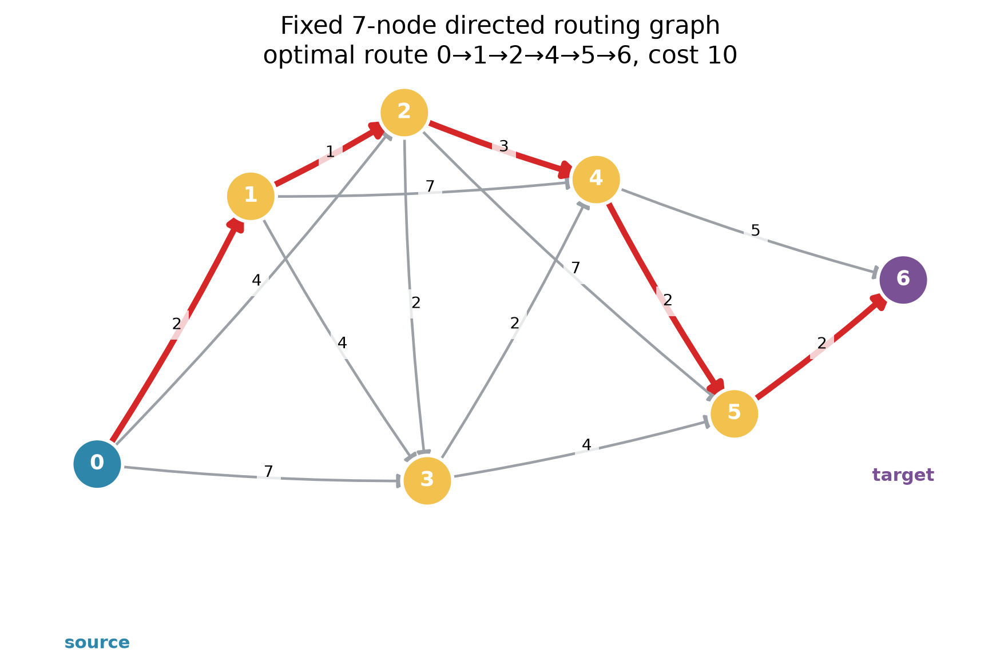
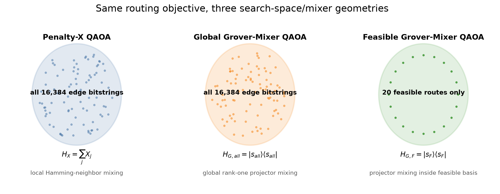
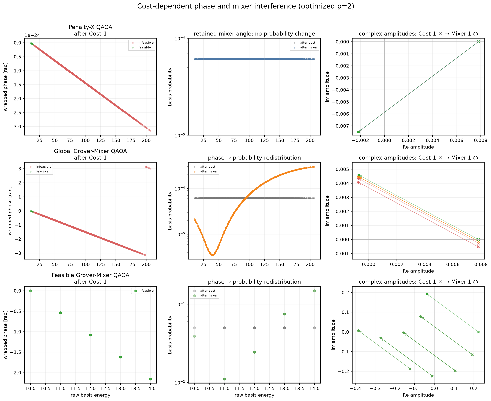

# QAOA dynamics deep dive: three search geometries for one routing problem

## 1. Routing problem

The fixed teaching instance is a directed acyclic graph with seven nodes,
fourteen weighted edges, source 0, and target 6. Two independent exact methods
(NetworkX weighted shortest path and deterministic exhaustive simple-path
enumeration) agree on the unique optimum

```text
0 -> 1 -> 2 -> 4 -> 5 -> 6, cost 10.
```

There are exactly 20 simple source-to-target routes. This project uses ideal
statevector simulation to study QAOA mechanisms at depths p=1 and p=2. It does
not claim quantum advantage over classical shortest-path algorithms.



## 2. Why one edge becomes one bit or qubit

The frozen edge order assigns bit `x_j` to edge `e_j`, with `x_j=1` meaning
that the edge is selected. Fourteen edges therefore give the full basis

\[
x=(x_0,\ldots,x_{13})\in\{0,1\}^{14},\qquad N=2^{14}=16,384.
\]

The integer state index uses `q0` as the least-significant bit; displayed
canonical bitstrings remain in explicit `q0 -> q13` order. Both Penalty-X and
Global-Grover use this exact representation and ordering.

## 3. Flow constraints

For node `v`, define

\[
f_v(x)=\sum_{e\in\delta^+(v)}x_e-\sum_{e\in\delta^-(v)}x_e-b_v,
\]

where `b_source=+1`, `b_target=-1`, and other supplies are zero. The frozen DAG
has the useful property that `f_v(x)=0` for every node agrees exactly with the
independent route decoder: 20 of the 16,384 bitstrings encode one valid route.

## 4. Penalty QUBO

The route term and flow penalty are

\[
C(x)=\sum_e w_e x_e,\qquad
P_{flow}(x)=\sum_v f_v(x)^2.
\]

The full-space cost is the existing frozen polynomial

\[
Q_6(x)=C(x)+6P_{flow}(x).
\]

No alternative penalty is introduced for Global-Grover. Exhaustive validation
finds a cost-10 optimum, a cost-11 second feasible route, and a lowest
infeasible QUBO energy of 12. Thus no infeasible bitstring lies at or below the
optimum under `A=6`.

## 5. QUBO-to-Ising mapping

The project uses

\[
x_j=\frac{1-Z_j}{2},
\]

and expands the canonical upper-triangular QUBO into

\[
H_C=c_0I+\sum_jh_jZ_j+\sum_{j<k}J_{jk}Z_jZ_k.
\]

The identity constant is retained. Exhaustive comparison over all 16,384 basis
states gives zero QUBO/Ising energy error. The Penalty-X and Global-Grover raw
diagonals are byte-identical and have the same SHA-256 digest
`66e208bbb544d6193cddae5da0517b0a6897624eceab8719ef56a25e58af542b`.

## 6. Cost Hamiltonian and normalization

The historical course simulator evolves with an affine-normalized diagonal.
For the full space,

\[
\widetilde H_C=(H_C-10I)/197,
\]

while the feasible route basis uses its existing normalization over costs
10 through 14. An affine transformation preserves energy ordering and only
rescales the optimized gamma convention. All reported `expected_hc` values in
the result table are raw energies, not normalized losses.

## 7. What the cost unitary does

For a diagonal energy `E_x`,

\[
U_C(\gamma)|x\rangle=e^{-i\gamma E_x}|x\rangle.
\]

An amplitude `a_x=|a_x|e^{i\phi_x}` becomes
`|a_x|e^{i(\phi_x-\gamma E_x)}`. Energy therefore enters the state as relative
phase.

## 8. Why cost evolution does not immediately change measurement probability

The phase factor has unit magnitude:

\[
|a_xe^{-i\gamma E_x}|^2=|a_x|^2.
\]

Every optimized trace confirms a maximum cost-step probability change below
`3e-20`. Because `U_C` is a function of `H_C`, it commutes with `H_C`; the raw
expected energy is invariant across each cost step within `1.5e-14`.

The right statement is therefore:

> The cost Hamiltonian encodes objective information into relative phases; the
> mixer converts those phase differences into interference and probability
> redistribution.

It is incorrect to say that a cost layer directly lowers the energy.

## 9. Standard X mixer as a hypercube walk

Penalty-X uses

\[
H_X=\sum_jX_j.
\]

Each `X_j` connects bitstrings at Hamming distance one, so the mixer is a
continuous-time walk on the 14-dimensional hypercube. The frozen course
parameter convention applies `exp[-i(beta/q) H_X]`; this scaling has been
preserved exactly.

## 10. Global Grover mixer

Global-Grover starts from the uniform state over every edge bitstring,

\[
|s_{all}\rangle=|+\rangle^{\otimes14}
=\frac1{\sqrt{16,384}}\sum_x|x\rangle,
\]

and follows the existing feasible-Grover sign convention:

\[
H_{G,all}=|s_{all}\rangle\langle s_{all}|,
\quad
U_G(\beta)=I+(e^{-i\beta}-1)|s_{all}\rangle\langle s_{all}|.
\]

For state `psi`, the implementation computes the overlap
`<s_all|psi>` and adds one rank-one correction. It takes `O(2^q)` time and
`O(2^q)` state memory; no `16,384 x 16,384` matrix is constructed. A deterministic
`q=3` test matches an explicit dense matrix exponential to `1e-12`.

## 11. Feasible Grover mixer

The preserved implementation enumerates the 20 simple routes, prepares

\[
|s_F\rangle=\frac1{\sqrt{|F|}}\sum_{P\in F}|P\rangle,
\]

and applies

\[
H_{G,F}=|s_F\rangle\langle s_F|,
\quad
U_{G,F}(\beta)=I+(e^{-i\beta}-1)|s_F\rangle\langle s_F|.
\]

Its cost vector is the route cost restricted to `F`, which equals the Penalty
QUBO on zero-flow-penalty states. Regression comparison with the untouched
historical simulator gives zero amplitude error for p=1 and p=2.

## 12. Search-space restriction

The full initial baselines are

\[
p_{feas}=20/16,384=0.001220703125,
\qquad
p_{opt}=1/16,384=0.00006103515625.
\]

The feasible initial baselines are `p_feas=1` and `p_opt=1/20=0.05`.
Comparing raw final `p_opt` without these baselines would confuse mixer effects
with representation restriction.

Measured preprocessing on this run was 0.01335 s for feasible-path enumeration
and 0.000147 s for feasible cost-vector construction. These small numbers are
instance-specific. More importantly, explicit enumeration exposes every cost,
so taking `argmin` already reveals the exact optimum classically. This logical
construction is a mechanism comparison, not a scalable shortest-path claim.



## 13. Constructive and destructive interference

After a cost layer, different energies generally point in different directions
in the complex plane. A mixer recombines amplitudes, producing constructive or
destructive interference in the computational basis. Interference need not
improve the objective at every layer: the optimized p=2 Global-Grover trace
first raises raw energy from 86.0 to 117.64, then the second mixer lowers it to
61.94. Feasible-Grover similarly rises from 12.20 to 12.92 before falling to
11.31.



## 14. Expected energy

For full-space methods the measured decomposition is

\[
\langle H_C\rangle=\langle H_{route}\rangle
+6\langle P_{flow}\rangle.
\]

At p=2, Global-Grover finishes with route contribution 21.9379 and penalty
contribution 40.0048, totaling 61.9427. Penalty-X remains at the uniform values
26 + 60 = 86 under its retained local optimum. For Feasible-Grover the penalty
term is structurally zero and the final raw energy is the expected route cost.

## 15. Why cost evolution preserves its own expected energy

Because `[U_C,H_C]=0`,

\[
\langle\psi|U_C^\dagger H_CU_C|\psi\rangle
=\langle\psi|H_C|\psi\rangle.
\]

The saved real-graph trace verifies this at every cost checkpoint. Horizontal
segments from Initial to Cost-1 and Mixer-1 to Cost-2 are the visual signature.


## 16. Why the mixer can change expected energy

The mixer generally does not commute with `H_C`. It can redistribute
probabilities and thus change the weighted energy average. A zero angle, a
uniform eigenstate, or a stationary optimizer point can make a particular
mixer step ineffective; “can change” is the correct general claim. The
retained Penalty-X p=2 point is such a boundary/stationary case, while both p=2
Grover runs show nonzero probability and energy changes.

## 17. Classical optimizer around the quantum state evolution

For each parameter request, the ideal simulator prepares the chosen initial
state, alternates cost then mixer operators, calculates the full probability
distribution, and returns expected normalized cost to COBYLA. The fixed policy
uses seed 2601, grouped parameters
`[gamma_1,...,gamma_p,beta_1,...,beta_p]`, bounds `gamma in [0,2pi]` and
`beta in [0,pi]`, tolerance `1e-8`, `rhobeg=0.5`, and at most 100 evaluations.
The p=1/p=2 grid scans are post-experiment teaching analyses and were not used
to retune the reported runs.

## 18. p=1 versus p=2

One layer has two degrees of freedom; two layers have four and can create a
second interference step. With the fixed single-start optimizer, all p=1 runs
retained their uniform probability baselines. At p=2, the two Grover
constructions found nontrivial redistribution. This is a result for one seed,
one local optimizer, and one graph—not a monotonic-depth theorem.

## 19. Main experiment results

| Method | p | dimension | p_feas | p_opt | invalid mass | raw `<H_C>` | `E[C|feasible]` | evals | optimize s |
|---|---:|---:|---:|---:|---:|---:|---:|---:|---:|
| Penalty-X | 1 | 16,384 | 0.00122070 | 0.00006104 | 0.99877930 | 86.0000 | 12.2000 | 50 | 1.206 |
| Penalty-X | 2 | 16,384 | 0.00122070 | 0.00006104 | 0.99877930 | 86.0000 | 12.2000 | 73 | 1.566 |
| Global-Grover | 1 | 16,384 | 0.00122070 | 0.00006104 | 0.99877930 | 86.0000 | 12.2000 | 32 | 0.224 |
| Global-Grover | 2 | 16,384 | 0.00417370 | 0.00021337 | 0.99582630 | 61.9427 | 12.1891 | 100 | 1.088 |
| Feasible-Grover | 1 | 20 | 1.00000000 | 0.05000000 | 0 | 12.2000 | 12.2000 | 23 | 0.050 |
| Feasible-Grover | 2 | 20 | 1.00000000 | 0.17092702 | 0 | 11.3066 | 11.3066 | 100 | 0.181 |

Optimizer `success=False` for both p=2 Grover cells means the fixed 100-request
cap was reached; their retained values are the best finite in-bounds values
seen, not convergence proofs.

The complete representative p=2 traces are:

| Method | checkpoint | `<H_C>` | p_feas | p_opt |
|---|---|---:|---:|---:|
| Penalty-X | Initial / Cost-1 / Mixer-1 / Cost-2 / Mixer-2 | 86 / 86 / 86 / 86 / 86 | 0.00122070 throughout | 0.00006104 throughout |
| Global-Grover | Initial | 86.0000 | 0.00122070 | 0.00006104 |
| Global-Grover | Cost-1 | 86.0000 | 0.00122070 | 0.00006104 |
| Global-Grover | Mixer-1 | 117.6428 | 0.00038257 | 0.00002165 |
| Global-Grover | Cost-2 | 117.6428 | 0.00038257 | 0.00002165 |
| Global-Grover | Mixer-2 | 61.9427 | 0.00417370 | 0.00021337 |
| Feasible-Grover | Initial | 12.2000 | 1.00000000 | 0.05000000 |
| Feasible-Grover | Cost-1 | 12.2000 | 1.00000000 | 0.05000000 |
| Feasible-Grover | Mixer-1 | 12.9217 | 1.00000000 | 0.03881024 |
| Feasible-Grover | Cost-2 | 12.9217 | 1.00000000 | 0.03881024 |
| Feasible-Grover | Mixer-2 | 11.3066 | 1.00000000 | 0.17092702 |

The 25x25 p=1 landscapes show structured parameter dependence even where the
single-start optimizer retained the baseline. Across the grids, maximum
`p_opt` is `6.10e-5` for Penalty-X, `2.34e-4` for Global-Grover, and `0.18597`
for Feasible-Grover. These scans are descriptive and do not replace the frozen
optimizer protocol.

## 20. What can and cannot be concluded

The same-representation comparison shows that changing only the mixer can
change shallow probability flow: Penalty-X and Global-Grover have byte-identical
cost diagonals and initial states, but their tested p=2 traces differ. The
two Grover projectors illustrate the effect of restricting support from 16,384
bitstrings to 20 valid routes. Feasible-Grover prevents invalid logical states,
but `p_feas=1` alone says nothing about scalability or computational utility.

This one graph cannot establish that Grover mixers are generally superior,
that p=2 is generally better than p=1, or that any quantum method beats
Dijkstra's algorithm. Feasible enumeration is explicitly classical,
non-scalable preprocessing, and the logical projector is not automatically a
hardware-efficient circuit. All timing values are ideal-simulation software
measurements on this run, not QPU benchmarks.
