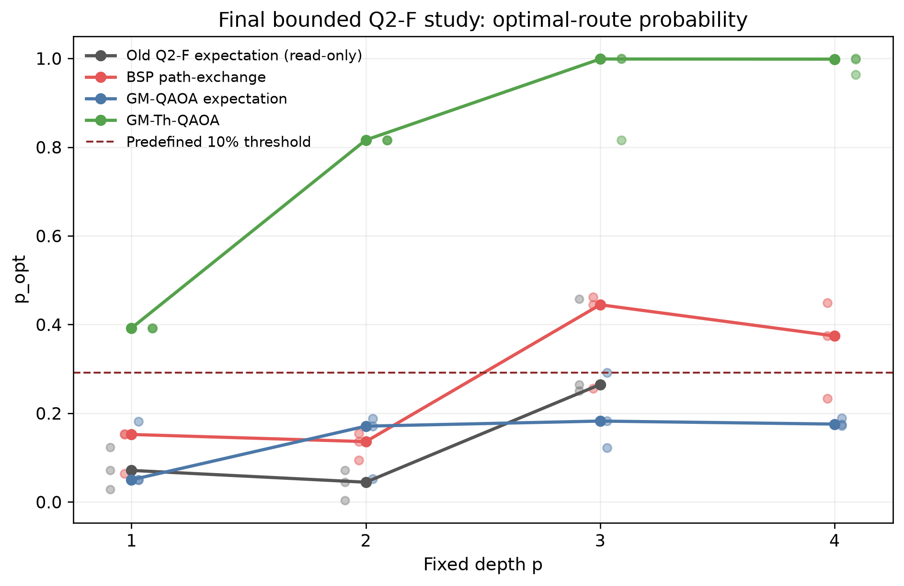
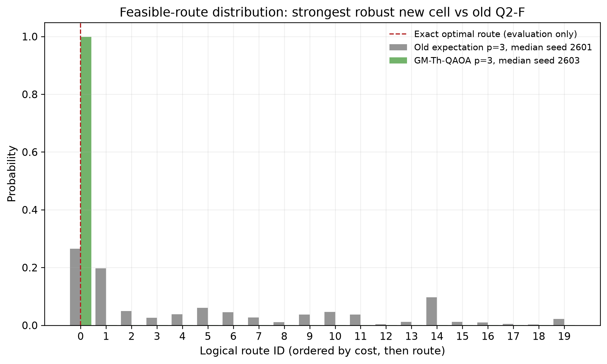
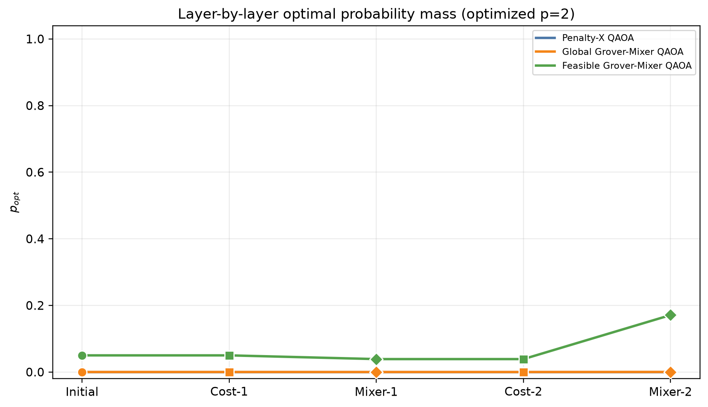
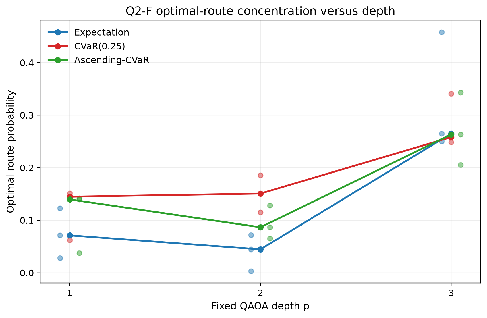

# QAOA Routing — Final Experimental Results

**QAOA 路由课程项目最终实验结果报告**  
**项目：** DTU SCIQIS Course Project  
**报告日期：** 2026-08-20  
**报告口径：** 正文以 Git 正式保留的课程实验为主；本机后续研究仅在附录中单独标记。  
**计算边界：** 单一固定图、ideal statevector simulation、无硬件噪声；不主张 quantum advantage。

---

## 1. Executive Summary

本项目研究一个固定的有向加权 routing problem：在 7 个节点、14 条有向边组成的图中，从 source 0 到 target 6 寻找总权重最小的合法路线。每条边对应一个 binary variable，也对应一个 qubit；完整 edge-bitstring 空间有 `2^14 = 16,384` 个状态，但其中只有 20 个状态能解码为合法 simple route。routing cost 与 flow-conservation penalty 组成 QUBO，再映射为对角 Ising cost Hamiltonian，QAOA 通过交替 cost phase 和 mixer 改变最终测量分布。

课程实验先研究完整 16,384-state 空间中的 Penalty-X 和 Global-Grover mixer，再研究只含 20 条合法路线的 feasible route basis。最终课程比较包括旧 Q2-F expectation、BSP/path-exchange、GM-QAOA expectation 和 incumbent-threshold GM-Th-QAOA。每个 method×depth cell 使用 seeds 2601、2602、2603；下表对每种方法选取其**已测试深度中 median `p_opt` 最高的深度**，所有数值均重新核对自 canonical CSV。

**表 1 — 最终课程结果：每种方法的最佳 median-depth 配置。** `p_feas`、`p_opt` 和 expected route cost 均为三个 seeds 的逐指标中位数；`p_opt_given_feas` 由 `p_opt/p_feas` 得到。旧 Q2-F 的 evaluation cap 为 100，新三种方法为 150，因此这是保存实验的结果汇总，不是严格同预算排行榜。

| Method | Depth | Seeds | Eval. cap | p_feas | p_opt | p_opt_given_feas | Expected cost |
| --- | ---: | ---: | ---: | ---: | ---: | ---: | ---: |
| Q2-F expectation | 3 | 3 | 100 | 1.000000 | 0.264901 | 0.264901 | 11.385906 |
| BSP / path-exchange | 3 | 3 | 150 | 1.000000 | 0.444656 | 0.444656 | 11.376769 |
| GM-QAOA expectation | 3 | 3 | 150 | 1.000000 | 0.182410 | 0.182410 | 11.976607 |
| **GM-Th-QAOA** | **3** | **3** | **150** | **1.000000** | **0.998712** | **0.998712** | **10.002983** |

最强课程结果是 **GM-Th-QAOA at depth 3**：median `p_opt = 0.998712`，三个 seed 的范围为 `0.816034–0.999804`，median expected route cost 为 `10.002983`。其成功来自两个同时存在的条件：表示空间已经被限制为 20 条合法路线，所以 `p_feas = 1` 是结构性质；threshold phase 再根据一个 cost-11 classical incumbent 标记所有 cost 严格小于 11 的路线。在本图上这个集合恰好只包含唯一的 cost-10 最短路。它是清楚的 teaching-scale probability-concentration result，但不是可扩展量子 routing solver，也不是 quantum-advantage evidence。

最重要的科学结论是：**保持 feasibility 与集中到 optimum 是两个不同问题。** feasible basis 自动消除了 infeasible probability mass，却不会单独保证 `p_opt` 很高；最终接近 1 的 `p_opt` 还依赖 phase/objective 与 mixer 的组合。课程 CVaR 扩展也给出了有价值的 negative result：CVaR 在浅层部分 cell 中较好，但在 depth 3 没有清楚、稳定地超过 expectation。

---

## 2. Experimental Problem

### 2.1 固定图与 exact reference

图定义保存在 `data/graph.json`，edge ordering 明确为 `(u,v)` lexicographic order，qubit indices 为 0–13。独立 shortest-path 与 feasible-route enumeration 一致确认唯一最优路线为：

`0 → 1 → 2 → 4 → 5 → 6`，exact cost `2 + 1 + 3 + 2 + 2 = 10`。

**表 2 — 冻结 routing instance。**

| Item | Frozen value |
| --- | --- |
| Graph | 7-node directed weighted graph |
| Source / target | 0 / 6 |
| Directed edges / qubits | 14 / 14 |
| Full bitstring space | `2^14 = 16,384` states |
| Decoder-valid simple routes | 20 |
| Unique exact route | `0→1→2→4→5→6` |
| Exact optimum cost | 10 |
| Second-best feasible cost | 11 |
| Lowest infeasible QUBO energy | 12 |
| QUBO flow penalty coefficient | `A = 6` |


### 2.2 从 edge variables 到 QUBO / Ising

对每条有向边定义 `x_e ∈ {0,1}`。`x_e=1` 表示选择该边。对每个节点构造 flow residual `r_v(x)`，source 需要净流出 1，target 需要净流入 1，其余节点净流为 0。冻结实验使用：

\[
Q(x)=\sum_e w_e x_e + 6\sum_v r_v(x)^2.
\]

通过 `x_j = (I-Z_j)/2` 将 QUBO 映射为 diagonal Ising Hamiltonian：

\[
H_C=c_0I+\sum_jh_jZ_j+\sum_{j<k}J_{jk}Z_jZ_k.
\]

保存的 scientific validation 对全部 16,384 个 basis states 比较 QUBO evaluator 与 Ising diagonal，最大误差为 `0.0`。Penalty-X 与 full-space Global-Grover 使用 byte-identical 的 cost diagonal，因此两者在 dynamics 中的差异来自 mixer 与优化轨迹，不来自不同的 routing objective。

---

## 3. Metrics

### p_feas

`p_feas` 是最终 probability distribution 落在所有合法 source-to-target routes 上的总概率：

\[
p_{feas}=\sum_{x\in F}P(x).
\]

完整 edge-bitstring 表示中，`F` 只含 20 个状态；其余 16,364 个状态为 infeasible。20-route logical basis 中每个 basis state 本身就是合法路线，所以保存结果验证 `p_feas = 1`（数值误差不超过 `10^-12`）。

### p_opt

`p_opt` 是所有 exact optimal routes 的总概率：

\[
p_{opt}=\sum_{x\in O}P(x).
\]

本实例只有一条 exact optimal route，因此 `p_opt` 就是 route ID 0，即 `0→1→2→4→5→6` 的 probability。它直接回答“一次按最终分布采样时得到最优路线的概率是多少”。

### p_opt_given_feas

当 `p_feas > 0` 时：

\[
p_{opt\_given\_feas}=\frac{p_{opt}}{p_{feas}}.
\]

该指标回答：“已经采到 feasible solution 的条件下，其中有多少比例是最优路线？”在课程 feasible-subspace 实验中 `p_feas=1`，所以它与 `p_opt` 相同；在 full-space 实验中两者可能相差很大。

### Expected cost

课程主实验中的 expected cost 是 20-route probability distribution 上的 raw route-cost expectation。由于该分布完全位于 feasible basis，它既不需要 penalty，也不需要条件化。Dynamics full-space 文件另存了 penalized `expected_hc` 和 conditional feasible route cost；本报告不把这两种量混成同一列。

---

## 4. From Full Space to Feasible Space

三个名称相近的方法实际使用不同的状态空间和 mixer：

- **Penalty-X QAOA：** 14 个 edge bits，完整 16,384-state 空间，local X mixer。feasibility 只能通过 QUBO penalty 与优化间接形成。
- **Global-Grover mixer QAOA：** 同一个完整 16,384-state 空间、同一个 penalized cost Hamiltonian，但使用 full-space rank-one projector mixer。它没有 feasible projection。
- **Feasible-Grover mixer QAOA：** 先由 classical enumeration 建立 20-route logical basis，只在这些合法路线之间演化，所以 `p_feas=1` 是表示方式的结构保证。


> **Important distinction:** `Global-Grover != Feasible-Grover != standard Grover search.` Global-Grover 与 Feasible-Grover 这里指 QAOA 中的 rank-one mixer；它们不是 textbook binary-oracle Grover algorithm。GM-Th-QAOA 又额外使用 incumbent-derived threshold phase，也不能与前两者视为同一算法。

保存的 shallow dynamics 数据显示，在 uniform full-space initial state 中，只有 `20/16384 = 0.001220703125` 的 probability mass 是 feasible，初始最优路线概率只有 `1/16384 = 0.00006103515625`。Feasible 20-route uniform state 则从 `p_feas=1`、`p_opt=1/20=0.05` 开始。两者的初始成功概率不同，主要是表示空间不同，而不是量子线路已经完成了优化。

**表 3 — 保存的 shallow dynamics 结果。** 每行使用 seed 2601、evaluation cap 100。`p=1/2` 是 alternating cost–mixer layers，不是 Grover iteration count。

| Method | Depth | Search states | p_feas | p_opt | Saved terminal status |
| --- | ---: | ---: | ---: | ---: | --- |
| Penalty-X | 1 | 16,384 | 0.001221 | 0.000061 | converged |
| Penalty-X | 2 | 16,384 | 0.001221 | 0.000061 | converged |
| Global-Grover mixer | 1 | 16,384 | 0.001221 | 0.000061 | converged |
| Global-Grover mixer | 2 | 16,384 | 0.004174 | 0.000213 | budget exhausted |
| Feasible-Grover mixer | 1 | 20 | 1.000000 | 0.050000 | converged |
| Feasible-Grover mixer | 2 | 20 | 1.000000 | 0.170927 | budget exhausted |


图 3 说明 feasible restriction 的直接作用：它把 infeasible mass 结构性地移除。但 `p_opt` 从 uniform feasible baseline 0.05 提高到 0.170927 仍需要 cost phase、mixer interference 和 classical parameter optimization。换句话说，**feasibility preservation 解决“合法不合法”，没有自动解决“是不是最优”。**

---

## 5. Final Course Experiment

### 5.1 方法与统计口径

最终课程结果由两组只读冻结实验组成。旧 Q2-F expectation 使用 incumbent-biased 20-route initial state、path-exchange mixer、depth 1–3、每 cell cap 100；新 bounded improvement matrix 使用同一个 20-route basis、depth 1–4、每 cell cap 150。所有 cell 都保留，不因结果好坏替换 seed。

新 matrix 的三种方法为：

- **BSP / path-exchange：** incumbent-biased feasible initial state，ordinary cost phase 与 path-exchange mixer，loss 为最大化 cost 严格低于 incumbent cost 11 的总概率。
- **GM-QAOA expectation：** uniform feasible initial state，feasible rank-one mixer，最小化 normalized route-cost expectation。
- **GM-Th-QAOA：** uniform feasible initial state，同一个 feasible rank-one mixer，threshold phase `h_T=1` 当且仅当 route cost `< 11`，并最大化 marked-set probability。

保存配置明确记录 `optimum_identity_used=false`。threshold 来自 deterministic incumbent route `0→1→2→3→4→5→6`、cost 11；实验构造完 threshold set 后才验证它在本实例恰好等于唯一 optimum set。

### 5.2 Depth comparison

**表 4 — 各方法 median `p_opt` 随 depth 的变化。** 每个可用 cell 都是 seeds 2601–2603 的中位数；旧 Q2-F 未执行 depth 4。所有列对应的 `p_feas` 均在 `1 ± 10^-12` 内。

| Method | p=1 | p=2 | p=3 | p=4 |
| --- | ---: | ---: | ---: | ---: |
| Q2-F expectation | 0.071193 | 0.044559 | 0.264901 | N/A |
| BSP / path-exchange | 0.152231 | 0.136082 | 0.444656 | 0.374339 |
| GM-QAOA expectation | 0.050000 | 0.170927 | 0.182410 | 0.175615 |
| **GM-Th-QAOA** | **0.392000** | **0.816080** | **0.998712** | **0.998429** |



关键观察有三点。第一，所有方法都在同一个 feasible basis 上，因此 `p_feas≈1` 不能用来区分它们。第二，普通 feasible Global mixer 并不自动胜过 path-exchange；GM-QAOA expectation 的最佳 median `p_opt` 只有 0.182410。第三，GM-Th-QAOA 的 threshold phase 显著改变 feasible basis 内部的 concentration，在 depth 3 和 4 都把 median `p_opt` 推到 0.998 以上。

### 5.3 最终 probability distribution



旧 expectation 分布仍把明显 probability mass 分散在多条 cost 11–14 路线上；GM-Th depth-3 median seed 2603 的最优路线概率为 `0.998712`。这一图展示的是 ideal statevector probability，不是 finite-shot frequency。最优路线只用于 evaluation 和图中标注，没有作为 bitstring label 直接交给 optimizer。

### 5.4 Validation

最终 matrix 的 36/36 required runs 全部存在，12 个 method×depth cells 每个都有 3 个 seeds；所有 probability vectors 归一化，`p_feas` 范围为 `0.9999999999999998–1.0000000000000002`，最大 optimizer evaluations 为 150。保存 validation 还确认 basis size=20、graph/config/source bundle 未改变、strict threshold 未改变、旧 Q2-F/Q2-R artifacts 未被触碰。选定的 GM-Th depth-3 三个 runs 都达到 150 次 cap，因此应把该结果表述为**冻结有限预算下的观测结果**，而不是 fully converged global optimum guarantee。

---

## 6. QAOA Dynamics: Why Did It Work?

QAOA 每层先施加 cost unitary，再施加 mixer。对 computational-basis probabilities 而言：

1. **Cost layer 写入 phase。** 因为 `H_C` 对角，cost unitary 改变 complex amplitude 的相位，但不会直接改变每个 basis state 的 probability。
2. **Mixer 产生 interference。** mixer 把带有不同 cost-dependent phases 的 amplitudes 混合，才会改变 probability distribution。
3. **Classical optimizer 选择 angles。** 保存 trajectory 是最终优化参数对应的 layer-by-layer evolution，而不是任意固定角度。



在 Global-Grover depth 2 轨迹中，第一次 mixer 将 `p_opt` 从 0.000061 降至约 0.000022，第二次 mixer 再升到 0.000213；`p_feas` 同时从 0.001221 经 0.000383 到 0.004174。Feasible-Grover depth 2 中，第一次 mixer 把 `p_opt` 从 0.05 降至 0.038810，第二次 mixer 再升到 0.170927，而 `p_feas` 在所有 checkpoints 都保持 1。这个非单调过程说明 cost phase 不是单独“把最优态概率变大”，真正的 probability transport 来自 phase 与 mixer interference 的组合。

Penalty-X depth 1/2 的保存最优参数在该浅层、有限预算 cell 中基本保留 uniform distribution；这只描述这些具体 runs，不能推出 X mixer 一般无效。相反，dynamics 数据支持的最稳妥机制解释是：

- feasible-space restriction 负责结构性消除 infeasible mass；
- cost layer 负责提供与 route cost 相关的 phase information；
- mixer 把 phase differences 转成 probability redistribution；
- GM-Th 的 threshold phase 进一步把“优于 incumbent”变成直接的 marked-set pressure，因此它比 ordinary expectation 更强地集中在本图唯一的 cost-10 route。

最终接近 1 的结果不能简单归因于“用了 Grover”。Feasible-Grover expectation 在 depth 2 只有 `p_opt=0.170927`，最终 GM-QAOA expectation 在 depth 3 的 median 也只有 `0.182410`；真正区分 GM-Th 的是 feasible representation、threshold phase、rank-one mixer 和 parameter optimization 的共同作用。

---

## 7. CVaR Extension

课程 CVaR 实验使用同一个 20-route path-exchange setup、同一个 incumbent-biased feasible initialization、每 cell cap 100，并比较 ordinary expectation、fixed CVaR(0.25) 和从 0.25 逐步升到 1.0 的 Ascending-CVaR。三个 objectives 各有 depth 1–3、seeds 2601–2603，共 27 rows。

**表 5 — CVaR 课程扩展。** `p_opt` 与 expected cost 是三 seeds 中位数；所有 rows 的 `p_feas=1`。观察列只描述保存矩阵，不作统计显著性声明。

| Objective | Depth | p_feas | Median p_opt | Median expected cost | Main observation |
| --- | ---: | ---: | ---: | ---: | --- |
| Expectation | 1 | 1.000000 | 0.071193 | 11.867800 | fixed CVaR 更高 |
| Expectation | 2 | 1.000000 | 0.044559 | 11.690213 | fixed CVaR 更高 |
| Expectation | 3 | 1.000000 | **0.264901** | **11.385906** | depth-3 objective winner |
| CVaR(0.25) | 1 | 1.000000 | **0.144809** | 11.675794 | shallow improvement |
| CVaR(0.25) | 2 | 1.000000 | **0.150788** | 11.902816 | shallow improvement |
| CVaR(0.25) | 3 | 1.000000 | 0.258176 | 11.646844 | below expectation |
| Ascending-CVaR | 1 | 1.000000 | 0.139573 | **11.598087** | near fixed CVaR |
| Ascending-CVaR | 2 | 1.000000 | 0.086644 | 12.061515 | below fixed CVaR |
| Ascending-CVaR | 3 | 1.000000 | 0.263190 | 11.631875 | near expectation |



课程层面的结论应明确写成 negative result：**CVaR did not provide a clear improvement in this course experiment.** Fixed CVaR 在 depth 1 和 2 的 median `p_opt` 高于 expectation，但在 depth 3 略低；Ascending-CVaR 也没有一致胜过两者。三 seeds、单一图与有限 optimizer budget 不支持更广泛的 CVaR superiority claim。

---

## 8. What We Learned

1. 完整 14-edge-bit space 中只有 `20/16384` 个 states 是合法路线，uniform initial state 因而把绝大部分 probability 放在 infeasible bitstrings 上。
2. 把演化限制在预枚举的 20-route feasible basis 会结构性保证 `p_feas=1`，但这来自 classical preprocessing 和 representation choice。
3. Feasibility preservation 不等于 optimal-state concentration：ordinary feasible Global mixer 的最佳 median `p_opt` 仍只有 0.182410。
4. Cost layer 直接改变 phase，mixer 通过 interference 改变 probability；保存的 layer trace 验证 cost checkpoints 保持 probabilities，而 mixer checkpoints 才发生 probability transport。
5. 在冻结课程配置中，incumbent-threshold GM-Th-QAOA at depth 3 给出最强结果：median `p_opt=0.998712`、median expected cost `10.002983`。
6. 课程 CVaR 扩展没有一致超过 expectation；这是应保留而不是掩盖的 negative result。

---

## 9. Limitations

- **Teaching-scale instance：** 所有结论来自一个固定的 7-node、14-edge graph；没有跨图 generalization evidence。
- **Ideal simulation：** 使用 exact/ideal statevector，没有 shot noise、gate noise、hardware connectivity 或 error mitigation。
- **Classical feasible enumeration：** 20-route basis 由 classical full enumeration 预先构造。对更大图，枚举本身可能不可扩展。
- **Threshold information：** GM-Th 使用 cost-11 deterministic incumbent，并标记所有 cost `<11` 的 routes。在本实例中 marked set 恰好只有唯一 optimum；在一般实例中 threshold 可能标记多条路线，也可能需要额外 classical knowledge。
- **Finite optimizer budgets：** 旧 Q2-F cap 为 100，新 final matrix cap 为 150；最终 GM-Th depth-3 三个 seeds 都达到 cap。不同方法的 initialization、objective 与 budget 也不完全相同。
- **Seed variability：** GM-Th depth-3 虽然 median 为 0.998712，但范围为 0.816034–0.999804；三个 seeds 不支持显著性或 robustness 的广泛结论。
- **Logical, not gate-level scalable：** feasible-basis mixer 是 20-dimensional logical simulation，不等同于已经构造了可扩展的 14-qubit hardware circuit。
- **No quantum-advantage claim：** exact shortest path 和全部 feasible routes 都能在该小实例上用 classical computation 直接得到；本项目展示的是 encoding、QAOA dynamics 与 probability concentration。

---

## 10. Reproducibility

从项目根目录运行最小 student-facing commands：

```bash
python scripts/run_course_final.py --seed 2601 --depth 1
python scripts/run_qaoa_visualizer.py --check
```

第一条命令运行小型课程演示，打印 exact shortest route、QUBO/Ising/QAOA 结果与 decoded metrics；第二条只检查当前 visualization 所需的冻结结果是否存在且一致。阅读本报告不需要重新执行历史优化实验。

核心证据位置：

- **Core result location:** `results/q2f_final_improvement/`
- **Mechanism analysis:** `results/qaoa_dynamics_deep_dive/`
- **CVaR extension:** `results/q2f_course_extension/`

本报告的主数值来源分别是 `summary/q2f_final_improvement_results.csv`、`summary/aggregate_by_method_depth.csv`、`final_summary.csv`、`dynamics_trace.csv`、`summary/q2f_results.csv` 与 `summary/aggregate_by_objective_depth.csv`。报告生成过程没有重新运行任何 scientific optimization。

---

## Appendix A — Historical Experiments

`results/q2_revision_formal/` 是项目早期的 full-space warm-start phase，属于 **HISTORICAL**，不是最终课程结果。它在全部 16,384 个 bitstrings 上使用 incumbent-biased product state 与 aligned mixer，单一 seed 2601，比较 expectation/CVaR(0.25) 以及 fixed/incremental depth。

主要 historical rows 为：A0 fixed expectation depth 3，`p_feas=0.767939`、`p_opt=0.002289`；A1 fixed CVaR depth 3，`p_feas=0.735417`、`p_opt=0.003085`；A2 incremental expectation depth 3，`p_feas=0.768800`、`p_opt=0.002308`；A3 incremental CVaR 在 depth 2 因 marginal-gain rule 停止，`p_feas=0.630534`、`p_opt=0.002054`。

这些结果说明 full-space warm-start 可以把 substantial mass 移入 feasible region，但最优路线的绝对概率仍很低。项目随后转向 20-route feasible basis，以便把“找到合法路线”和“在合法路线中集中到 optimum”分开研究。Q2-R 只有单 seed，且采用历史实现约定，因此不能与最终三-seed feasible experiment 并列为两个“最终答案”。其 sealed manifest 15/15 entries 匹配，reaudit 为 108/108 checks passed。

---

## Appendix B — Post-Course Research Extensions

> **POST-COURSE RESEARCH EXTENSION.** 以下四个大型目录在当前工作区被 `.gitignore` 的 `results/*` 规则忽略，不属于正常课程 Git submission 的核心证据。它们没有被用于替换正文的课程结果；这里仅说明本机后续研究问了什么、观察到什么。

**表 6 — `results/` 审计、分类与提交状态。** 分类根据保存 config/report/canonical/validation 内容，而不是仅凭目录名。`Tracked` 表示当前 Git 正式保留；`Local ignored` 表示本机存在但 fresh course clone 不保证包含。

| Result root | Canonical / summary evidence | Classification | Submission status |
| --- | --- | --- | --- |
| `q2_revision_formal` | `formal_results.csv/json`; reaudit 108/108 | HISTORICAL | Tracked |
| `q2f_course_extension` | `q2f_results.csv`; objective-depth aggregate; 130/130 | COURSE_EXTENSION | Tracked |
| `q2f_final_improvement` | 36-row final CSV; method-depth aggregate; validation PASS | COURSE_MAIN | Tracked |
| `qaoa_dynamics_deep_dive` | `final_summary.csv`; `dynamics_trace.csv`; scientific validations | COURSE_EXTENSION | Tracked |
| `global_depth110` | 220-row `canonical_rows.csv`; report; 43/43 | POST_COURSE_RESEARCH | Local ignored |
| `global_depth110_recovery_bfo_v1` | 74-row canonical; ablation summaries; 40/40 | POST_COURSE_RESEARCH | Local ignored |
| `cvar_robustness_v1` | 140-row canonical; paired summaries; 43/43 | POST_COURSE_RESEARCH | Local ignored |
| `cvar_search_control_mechanism_v1` | 60-row canonical; trajectories; 836/836 | POST_COURSE_RESEARCH | Local ignored |

### B.1 Depth 1–110

`global_depth110/` 在相同 full 16,384-state domain、相同 penalized cost 下比较 Penalty-X 与 Global-Grover，depth 1–110 共 220 rows。Penalty-X 的 best observed `p_opt=0.002833` at p=21；Global-Grover 的 best observed `p_opt=0.001030` at p=110。两条轨迹都高度非单调，均未达到 `p_opt=0.10`，且 220/220 rows 都是 budget-limited，因此不能把深度曲线解释为 fully optimized ansatz scaling。

### B.2 High-depth recovery

`global_depth110_recovery_bfo_v1/` 用 74 个 cells 分解 budget、Fourier parameterization 与 CVaR objective 的作用。预先指定的 primary Global-Grover combined cell 没有恢复 historical p=110 result；探索性最强 cell 是 Penalty-X p=110、Direct CVaR(0.10)，`p_opt=0.007741`。保存分析把主要问题归因于 expectation-objective mismatch，但这仍是单图、有限预算的后续研究观察。

### B.3 CVaR robustness

`cvar_robustness_v1/` 使用 fresh paired seeds 共 140 cells。Penalty-X p=110 的 frozen primary rule 只得到 7/10 wins，分类为 `MIXED_CVAR_RECOVERY`；descriptive Global-Grover block 为 10/10 wins，median ratio 3.929。分布分析将主要变化解释为 feasible/low-energy region amplification，而不是稳定提高 `p_opt_given_feas`。绝对 `p_opt` 仍约为千分之几。

### B.4 Search-control mechanism

`cvar_search_control_mechanism_v1/` 进一步保存 60 cells、budget trajectories 与 optimizer/restart controls。Global-Grover CVaR(0.10) 在 11,000-evaluation endpoint 保持 10/10 wins，median `p_opt=0.002165`，paired median ratio 2.889；Nelder-Mead 方向仍为正但幅度较弱。Restart evidence 支持“continued CVaR objective pressure”而不是仅仅发现一个可交给 expectation 的好 basin。该目录同样只支持 matched finite-budget mechanism claim，不支持 quantum advantage、跨任务 generality 或高绝对成功率。

综上，后续研究丰富了对 depth、CVaR 与 optimizer interaction 的理解，但**课程正式主结论仍是正文中的 20-route feasible-space final experiment 与 shallow dynamics evidence**。
