# 从加权路由图到深层 QAOA：

# 约束处理、Grover Mixer、CVaR 目标与概率输运机制的系统研究

## Penalty-X 与 Global-Grover 在加权路由问题中的深度、优化目标与搜索控制分析

**项目/课程：** DTU SCIQIS Course Project  
**作者：** ZhilinChen02（仓库 Git 作者标识）  
**报告日期：** 2026-08-19  
**代码仓库：** `ZhilinChen02/sciqis-qaoa-routing`  
**证据范围：** 仓库中现存的冻结实现、canonical scientific rows、distribution/checkpoint、验证记录与图；完整来源表见 [`QAOA_ROUTING_FINAL_REPORT_CN_EVIDENCE_INDEX.md`](QAOA_ROUTING_FINAL_REPORT_CN_EVIDENCE_INDEX.md)。  
**计算范围：** ideal NumPy complex128 statevector simulator；一个固定的 14-qubit 有向加权路由实例；未在 QPU 上执行，未加入硬件噪声。  
**明确边界：本研究不主张量子优势。**

---

# 摘要

本项目研究如何用量子近似优化算法（QAOA）表示并搜索一个固定的有向加权路由问题，并进一步分析约束处理、mixer、线路深度、经典优化目标和 optimizer 如何共同决定最优路线的概率。实例含 7 个节点、14 条有向边，以边变量构造含流守恒罚项的 QUBO，再映射为 Ising cost Hamiltonian；独立经典求解确认唯一最短路线为 (0\to1\to2\to4\to5\to6)，代价为 10。项目从浅层 Penalty-X、warm-start 与逻辑 feasible-subspace 实验出发，随后在相同 (2^{14}) 全空间上比较 Penalty-X 与 Global-Grover，并将深度完整扩展到 (p=1,\ldots,110)。深度研究中，Penalty-X 的观测峰值为 (p=21) 时 (p_{opt}=0.002833)，Global-Grover 的峰值为 (p=110) 时 (0.001030)；两条轨迹均高度非单调，且从未达到 (p_{opt}=0.10)，因此没有 textbook Grover 式跃迁。

第一阶段 140-cell CVaR robustness study 显示：Global-Grover 在 (p=110) 的 10 个 fresh paired seeds 中全部由 CVaR-0.10 获胜，中位 (p_{opt}) 从 (5.464\times10^{-4}) 提高到 (2.264\times10^{-3})；Penalty-X 仅 7/10，按冻结规则保留为 `MIXED_CVAR_RECOVERY`。随后 60-cell、495,000-evaluation 的 prospective search-control study 进一步证明，Global-Grover 的 recovery 在 COBYLA budget 从 1,000 增至 11,000 时始终为 10/10，终点中位比率 2.889；Nelder-Mead 仍为 5/5 正方向，但中位比率降至 1.768，表明效应幅度与 optimizer 交互。Objective-switch 实验中，(C\to E) 的 (p_{opt}) 在 5/5 seeds 下降，而 (E\to C) 在 5/5 上升，支持 `OBJECTIVE_PRESSURE_REQUIRED`，而非“CVaR 只找到可转交给 Expectation 的好 basin”。分布轨迹显示，Global-Grover 的主要变化是 low-energy 与 feasible-region probability transport，而不是同等强度的 feasible 内部 sharpening；Penalty-X 在新五种子块也可受益，但呈现更强的条件内 sharpening、较弱的全局输运。最终的 Global-CVaR 中位绝对成功概率仍只有约 0.216%，故本项目的贡献是受控地区分深度、mixer、objective 与 classical search control 的作用，而不是宣称问题已被高概率解决、存在普适优越性或量子优势。

# 1. 项目背景与研究问题

路由问题是约束组合优化的典型例子：一个候选解既要选择低权重边，又必须组成从 source 到 target 的完整路径。它因此适合检验 QAOA 中两个彼此不同的问题：一是能否把概率移入 **feasible region**，二是在已经可行的概率中能否进一步集中到最优路线。单看平均能量无法可靠地区分这两个过程。

项目最初的工程路线是：固定 graph，定义 edge binary variables，构造 QUBO，映射到 Ising Hamiltonian，再实现浅层 QAOA 和经典 COBYLA 优化。随着严格的逐层 dynamics、逻辑 feasible-subspace 和 full-space 深度实验积累，问题演化为：线路深度本身是否足够，还是 mixer、objective 和 classical optimizer 才决定 probability mass 如何移动？历史单 cell 曾提示 CVaR 可能改善最优概率，但其 robustness、有限 budget 混杂、optimizer 依赖和机制均未解决，于是形成两项冻结的 fresh-seed 研究。

最终研究问题为：

1. **RQ1：** Penalty-X 与 Global-Grover 如何分别处理可行性与最优路线概率？
2. **RQ2：** 增加 QAOA 深度至 (p=110) 是否带来持续改善或类似 Grover search 的跃迁？
3. **RQ3：** CVaR 是否能稳定提高 (p_{opt})？
4. **RQ4：** 这种 CVaR 改善是否只是 optimizer budget 不足造成？
5. **RQ5：** 这种改善是否依赖 COBYLA？
6. **RQ6：** CVaR 是否只发现了一个更好的 parameter basin，随后 Expectation 也能维持？
7. **RQ7：** Global-Grover 与 Penalty-X 为什么对 CVaR 呈现不同响应？
8. **RQ8：** CVaR 实际改变了 probability distribution 的哪一部分？

本报告采用 evidence-first 写法。数字以 canonical row、checkpoint 或冻结 aggregate 为依据；historical/pilot、descriptive、mechanistic 与 confirmatory evidence 保持分层，独立 seed sets 不作统计合并。

# 2. 路由问题与经典参考解

## 2.1 冻结有向图

图由 `data/graph.json` 固定。每条有向边对应一个 qubit/二元变量，(x_e=1) 表示选中该边，(x_e=0) 表示不选。

| 配置项 | 冻结值 |
| --- | --- |
| 节点数 | 7（0–6） |
| 有向边数 / qubits | 14 |
| source / target | 0 / 6 |
| full computational space | (2^{14}=16,384) states |
| decoder-valid simple routes | 20 |
| penalty coefficient | (A=6) |
| 唯一最优路线 | (0\to1\to2\to4\to5\to6) |
| 最优 cost | 10 |
| 最优 state index / bitstring | 10377 / `10010001000101`（显示顺序 q0→q13） |

冻结 edge ordering 如下。

| Qubit | Edge | Weight | Qubit | Edge | Weight |
| ---: | --- | ---: | ---: | --- | ---: |
| q0 | 0→1 | 2 | q7 | 2→4 | 3 |
| q1 | 0→2 | 4 | q8 | 2→5 | 7 |
| q2 | 0→3 | 7 | q9 | 3→4 | 2 |
| q3 | 1→2 | 1 | q10 | 3→5 | 4 |
| q4 | 1→3 | 4 | q11 | 4→5 | 2 |
| q5 | 1→4 | 7 | q12 | 4→6 | 5 |
| q6 | 2→3 | 2 | q13 | 5→6 | 2 |


**图 1. 冻结路由实例。** 读者应注意 source=0、target=6，以及唯一 cost-10 路线经过边 q0、q3、q7、q11、q13。

## 2.2 经典目标与独立验证

路线代价为

\[
C(x)=\sum_{e\in E}w_e x_e.
\]

令 (b_v=1)（source）、(b_v=-1)（target），其他节点 (b_v=0)。流守恒 residual 为

\[
r_v(x)=\sum_{e\in\delta^+(v)}x_e-
       \sum_{e\in\delta^-(v)}x_e-b_v,
\]

有效路径必须对每个节点满足 (r_v(x)=0)，并由独立 decoder 确认选中边恰好构成一条 source-to-target path、没有多余残边。当前 `src/graph.py` 同时执行 NetworkX weighted shortest path 与全部 simple-route 枚举；`src/qubo.py` 再用独立 edge-selection decoder 检查基态。三条路径一致得到 20 条可行路线和唯一 cost-10 最优解。该 exact reference 只用于验证和最终 metrics，不把最优 bitstring 泄漏给 optimizer。

# 3. 从 QUBO 到 Ising Hamiltonian

仓库实际实现的 penalized routing QUBO 为

\[
Q_A(x)=\sum_e w_e x_e+A\sum_v r_v(x)^2,
\qquad A=6.
\]

第一项奖励短路线，第二项对流守恒违反施加二次罚。全枚举证据显示最优 feasible energy 为 10，次优路线 cost 为 11，最低 infeasible QUBO energy 为 12，因此在该冻结实例上 (A=6) 把最低能态保持为有效最短路。这个结论是实例内验证，不是任意 graph 上的通用 penalty 定理。

二元变量与 Pauli-Z 的关系为

\[
x_j=\frac{I-Z_j}{2}.
\]

把 QUBO 的线性项 (a_jx_j) 与二次项 (b_{jk}x_jx_k) 逐项替换后，可整理为对角 Ising cost Hamiltonian

\[
H_C=c_0I+\sum_j h_jZ_j+\sum_{j<k}J_{jk}Z_jZ_k.
\]

`src/qubo.py` 保留 (c_0,h,J) 的构造和 state-index/bit-vector 约定。冻结 dynamics validation 对全部 16,384 个 basis states 比较 QUBO 与 Ising diagonal，最大误差为 0；Penalty-X 与 full-space Global-Grover 使用 byte-identical 的 raw diagonal（SHA-256 `66e208…542b`）。这一步很重要：后续 mixer 差异不能归因于不同 cost function。

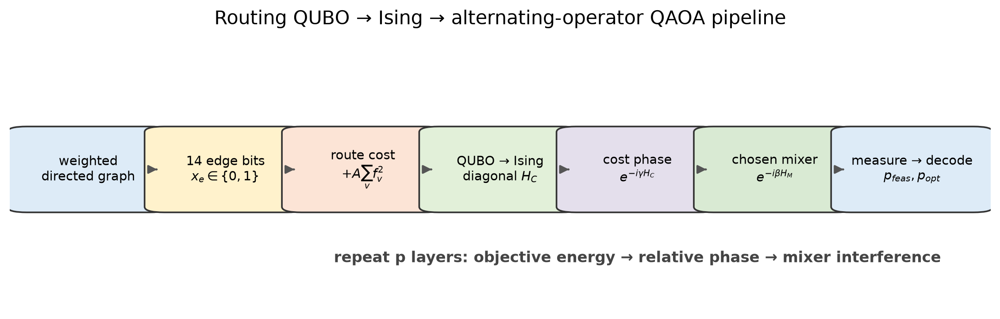

**图 2. graph→QUBO→Ising→QAOA→decode 管线。** Hamiltonian 编码与 decoder 评价分开，使 optimizer 不接触 exact optimal label。

# 4. QAOA 方法

对于深度 (p)，仓库使用按层交替的 cost 和 mixer evolution。以 cost-then-mixer 约定写作

\[
|\psi_p(\boldsymbol\gamma,\boldsymbol\beta)\rangle=
\prod_{\ell=1}^{p}e^{-i\beta_\ell H_M}
e^{-i\gamma_\ell H_C}|\psi_0\rangle.
\]

参数向量按所有 gamma 后接所有 beta 排列：

\[
\theta=(\gamma_1,\ldots,\gamma_p,\beta_1,\ldots,\beta_p),
\]

因此有 (2p) 个 physical angles。这里 (p) 是 cost/mixer alternating layers 的数量，不是 textbook Grover iteration count。

| 方法 | 表示空间与初态 | Mixer / phase | 可行性来源 | 证据角色 |
| --- | --- | --- | --- | --- |
| Penalty-X | 14 edge bits，full (2^{14})，∣s⟩=∣+⟩^14 | penalized (H_C) + X mixer | energy penalty；不保证结构可行 | shallow 与 p1–110 primary comparator |
| Warm-start Q2-R | full (2^{14})，incumbent-biased product state | incumbent-aligned single-qubit mixer | penalty + warm bias | historical/pilot，单 seed |
| Path-exchange Q2-F | 预枚举 20-route logical basis | logical route-exchange mixer | structural feasible subspace | descriptive teaching/mechanism |
| Feasible Global / GM-Th | 20-route logical basis，uniform | rank-one feasible mixer；普通 cost 或 threshold phase | structural feasible subspace | descriptive/exploratory |
| Global-Grover（主研究） | full (2^{14})，∣s⟩=∣+⟩^14 | continuous penalized cost + rank-one full-space mixer | penalty；无 projection | p1–110、CVaR robustness 与机制主角 |

## 4.1 Penalty-X

Penalty-X 在全部 16,384 个 bitstrings 上演化。Cost Hamiltonian 同时含 routing cost 与 flow penalty；X mixer 的生成元为 (H_M^X=\sum_jX_j)。因此它能在 hypercube 上改变每一位 edge selection，但不会保持 feasibility：可行概率必须通过 penalized energy landscape 和 optimizer 逐渐形成。

实现演化需要明确区分版本。早期 course dynamics 与 Q2-R 保留历史 `β/q` mixer-angle scaling；冻结的 `global_depth110` 及之后 full-space CVaR studies 明确使用 (e^{-i\beta\sum_jX_j})，不作 `β/q` 缩放。报告中的跨 mixer 深度/CVaR 比较均以各自冻结协议为准，不把这两版轨迹直接统计合并。

## 4.2 Warm-start

Q2-R 是实际执行过的 historical warm-start phase。它从 deterministic greedy incumbent (b) 构造 product state：若 incumbent bit 为 1，则 (c_i=1-\epsilon)，否则 (c_i=\epsilon)，冻结 (epsilon=0.1)，并制备

\[
|\phi_0\rangle=\bigotimes_i
(\sqrt{1-c_i}|0\rangle+\sqrt{c_i}|1\rangle).
\]

对应 aligned mixer 含 X 与 Z 分量，使该单 qubit 初态为 mixer eigenstate。8 个 formal runs 均完成；p=3 fixed expectation（A0）得到 (p_{opt}=0.00228946)、(p_{feas}=0.767939)，CVaR-0.25（A1）得到 (0.00308458)、(0.735417)。但它只有 seed 2601，且目标是 warm-start 与 incremental-depth 的早期 factorial，因此属于 `HISTORICAL/PILOT`，不能用来证明 CVaR robustness。

## 4.3 Path-exchange / feasible-subspace 方法

Q2-F 先用 classical enumeration 列出全部 20 条 feasible simple routes，再把每条路线视作一个 logical basis state。Path-exchange mixer 连接共享前缀/后缀之间存在 divergence–reconvergence 的路线；冻结图上得到 106 个 exchange。由表示本身，(p_{feas}=1) 是 structural identity，而不是量子线路主动恢复出的经验结果。

Q2-F course extension 含 27 cells（3 objectives×3 depths×3 seeds）。在 p=3，median (p_{opt}) 分别为 Expectation 0.264901、CVaR-0.25 0.258176、ascending-CVaR 0.263191。后续 36-cell final improvement 中，feasible Global threshold（GM-Th）p=3 median (p_{opt}=0.998712)。它展示了在一个只有 20 个、预先枚举的 route basis 上 threshold amplification 可以非常强；但它不是 14-qubit gate-level scalable routing implementation，也不能与 full-space (p_{opt}) 作公平算法排名。

## 4.4 Global-Grover

本仓库主研究中的 **Global-Grover** 不在 20-route feasible subspace 中运行。它和 Penalty-X 一样使用 full 16,384-state computational basis、相同的 uniform 初态

\[
|s\rangle=\frac{1}{\sqrt{16384}}\sum_x|x\rangle,
\]

以及相同 continuous penalized (H_C)。其 mixer 是 rank-one projector

\[
H_M^G=|s\rangle\langle s|,
\qquad
U_M^G(\beta)=I+(e^{-i\beta}-1)|s\rangle\langle s|.
\]

它会对 full-space amplitudes 做全局耦合，但没有 binary marked-state oracle、没有 feasible projection、没有预先知道最优路线。名称中的 Grover 指 rank-one diffusion-like mixer 结构，而非在执行标准 Grover algorithm。仓库另有 `grover_feasible`/GM-Th，它们是不同的 20-state logical experiment，本文始终分别命名。

# 5. 优化器与评价指标

## 5.1 COBYLA 与 budget

COBYLA 是无需梯度的 constrained optimization method，通过局部线性近似和 trust-region-like radius 调整参数。主 full-space studies 约束 (gamma_j\in[0,2\pi])、(eta_j\in[0,\pi])，以 statevector 计算训练 objective。一次 **optimizer evaluation** 是 optimizer 请求一次 objective；它不是一次最终 measurement shot。

`global_depth110` 的 budget 为 (\max(120,2(2p)+64))，所以 p=110 的 220 参数只有 504 次 objective evaluations。Robustness study 则按深度使用 2,500（p50）、5,000（p100）、5,500（p110）。Search-control 的 A/D 为每 cell 11,000，B/C 为 5,500。所有后两项研究的 cells 都耗尽 budget；因此结论属于 matched finite-budget search behavior，不是 fully converged optimum comparison。

Nelder-Mead 只在第二研究的 sensitivity block 使用。它以 simplex 搜索、同样有 5,500 evaluations 和相同初始向量，用于检验方向能否跨 optimizer 复现，而不是构建 optimizer 排行榜。

## 5.2 Expectation objective

Expectation 最小化完整 penalized-energy distribution 的平均值：

\[
L_E(\theta)=\sum_xP_\theta(x)E(x).
\]

它同时受到大量高概率、高能量 states 的影响，可能偏好整体平均 energy 的改善，而不直接奖励少量最优概率。

## 5.3 CVaR objective

对最小化问题，CVaR-(alpha) 将 states 按 energy 从低到高排序，只平均累计概率中最低的 (alpha) 部分。若第 (k) 个 state 跨过 cutoff，仓库实现精确使用该 atom 的必要 fraction：

\[
L_{\mathrm{CVaR},\alpha}=
\frac{1}{\alpha}\left[
\sum_{i<k}p_iE_i+
\left(\alpha-\sum_{i<k}p_i\right)E_k
\right].
\]

(alpha=0.10) 的含义是 optimizer 对完整 penalized distribution 的最低能量 10% probability mass 施压；它不先对 feasible states renormalize，也不等于保留固定数量的 bitstrings。该 alpha 是先前 exploratory evidence 后冻结的机制研究设置，并非 universal optimum。

## 5.4 Metrics

| Metric | 仓库定义 | 科学含义 |
| --- | --- | --- |
| (p_{feas}) | decoder-valid route states 的总概率 | 分布进入 feasible region 的程度 |
| (p_{opt}) | exact optimal-route mask 的总概率 | 单次理想采样得到最优路线的概率 |
| (p_{opt\mid feas}) | (p_{opt}/p_{feas})（若 (p_{feas}>0)） | 已知样本可行后，它为最优的条件概率 |
| expected feasible cost | 对 feasible distribution 条件化后的 route cost 期望 | feasible solutions 的平均质量 |
| Top-3 / Top-5 mass | 按真实 route cost 和 state index 排序，最好 3/5 条 feasible routes 的**绝对**概率 | 好路线获得的绝对 probability mass |
| low-energy top-100 mass | penalized energy 最低 100 个 full-space states 的绝对概率 | 广义 low-energy transport，含 feasible 与可能的低能 infeasible states |
| full entropy | (-\sum_xp_x\ln p_x) | full distribution 的扩散/集中描述；低 entropy 不自动等于更好 |
| feasible entropy | 对 feasible states 条件化后的 Shannon entropy | feasible component 内部的扩散程度 |

在唯一最优 state 且 definitions 一致时，有严格恒等式

\[
p_{opt}=p_{feas}\,p_{opt\mid feas}.
\]

这将机制拆成两个通道：提高进入 feasible region 的概率，或在 feasible component 内把更多比例压到 optimum。后文的核心发现正是 Global-Grover CVaR 主要改变前者。

# 6. 实验路线与版本演化

| Phase | Scientific question | Methods | Depth | Seeds / cells | Budget | Status / evidence class |
| --- | --- | --- | --- | --- | --- | --- |
| 1. Shallow dynamics | Hamiltonian、cost/mixer layer 与 decoder 是否一致？ | Penalty-X、full Global、feasible Global | p1–2 | seed2601；6 cells | 100 | `HISTORICAL/PILOT` + implementation validation |
| 2. Q2-R warm-start | aligned warm-start 下 objective/depth policy 有何变化？ | Expectation/CVaR-.25；fixed/incremental | p1–3 | seed2601；8 runs | 100–300 | formal historical，单 seed |
| 3. Q2-F course extension | structural feasibility 与 path exchange 如何表现？ | path-exchange；E/CVaR/ascending | p1–3 | 3 seeds；27 cells | 100 | descriptive logical-subspace |
| 4. Q2-F final improvement | threshold phase 在 20-route basis 是否可放大 better-than-incumbent route？ | BSP、GM-E、GM-Th | p1–4 | 3 seeds；36 cells | 150 | descriptive/exploratory；GM-Th p3 selected |
| 5. Full-space depth | 深度至 110 是否产生稳定或 Grover-like 转变？ | Penalty-X vs Global-Grover，Expectation | p1–110 | 220 rows；一条 frozen continuation trajectory/mixer | 120–504 | frozen descriptive primary |
| 6. Recovery BFO pilot | budget、Fourier、CVaR 哪个可能解释深度结果？ | budget/Fourier/objective ablations | selected p21/22/50/100/110 | 74 cells | protocol-dependent | `HISTORICAL/PILOT`；提出 CVaR hypothesis |
| 7. `cvar_robustness_v1` | CVaR recovery 能否在 fresh paired seeds 复现？ | Penalty-X/Global；E/CVaR；alpha/depth blocks | p50/100/110 | 140 cells | 2500/5000/5500 | frozen confirmatory + descriptive secondary |
| 8. `cvar_search_control_mechanism_v1` | budget、optimizer、basin 与 transport 如何解释 recovery？ | Experiments A–D | p110 | 60 cells，fresh seeds8801–8810 | 5500/11000 | prospective confirmatory endpoint + mechanistic |

这些阶段具有不同 statistical identity。特别是：20-route logical experiments 与 16,384-state full-space experiments 不可直接排名；BFO 的 single-cell pilot 不可替代 fresh paired replication；两次 CVaR study 的 seed sets 只能描述性对照，不能未经授权合并成更大的 inferential sample。

# 7. 深度 p=1–110：Penalty-X 与 Global-Grover

`results/global_depth110` 在相同 full space、相同初态、相同 raw penalized cost 和相同 COBYLA budget rule 下，保存了两种 mixer 各 110 个深度的 canonical rows。每个 (p>1) 从前一层优化参数续接并加入一个 seeded small-angle layer；因此它测量的是两条 deterministic finite-budget continuation trajectories，不是每个深度的独立 multi-start global optimization。

| Metric | Penalty-X | Global-Grover |
| --- | ---: | ---: |
| depth points / rows | 110 / 110 | 110 / 110 |
| best observed p | 21 | 110 |
| best observed (p_{opt}) | 0.002833154 | 0.001029783 |
| p=110 (p_{feas}) | 0.146970227 | 0.021946098 |
| p=110 (p_{opt}) | 0.000357867 | 0.001029783 |
| p=110 (p_{opt\mid feas}) | 0.002434964 | 0.046923304 |
| p=110 expected penalized cost | 18.3693 | 33.2746 |
| p=110 budget / parameters | 504 / 220 | 504 / 220 |
| budget-limited rows | 110/110 | 110/110 |

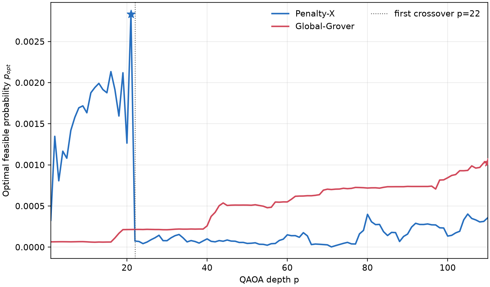

**图 3. (p_{opt}) 对 depth。** Penalty-X 在 p=21 出现局部峰值后骤降；Global-Grover 的后段整体上升但仍有大量方向变化，二者均非单调 scaling curve。

主要观测如下：

1. Penalty-X 从 p1 的 (p_{opt}=0.000326728) 上升至 p21 的全程观测峰值 0.002833154，p22 随即降到 (7.449\times10^{-5})，最终 p110 为 0.000357867。
2. Global-Grover 在浅层接近 uniform baseline，p50 为 0.000511605，p90 为 0.000738754，p110 达到自身峰值 0.001029783。
3. Global-Grover 第一次在 (p_{opt}) 上超过 Penalty-X 是 p=22；之后冻结轨迹中 Penalty-X 未再次超过。然而“crossover”是这两条 optimizer trajectories 的事实，不是 mixer 全局优越性定理。
4. Penalty-X 在 110/110 depths 都有更高 (p_{feas})。到 p110，它把 14.697% probability 放入 feasible routes，而 Global 只有 2.195%。
5. 条件于 feasibility，Global-Grover 在 89/110 depths 有更高 (p_{opt\mid feas})；p110 时 0.046923 对 0.002435。这说明它进入 feasible space 较少，但进入后分配给 optimum 的比例通常更高。
6. (p_{opt}) 方向变化计数为 Penalty-X 52 次、Global 50 次；p90–110 内仍分别有 6 和 9 次。两者均具有 oscillatory/nonmonotonic response。
7. 任何方法在任何深度都没有达到 (p_{opt}\ge0.10)；0.25、0.50 及更高 thresholds 同样全部未达。

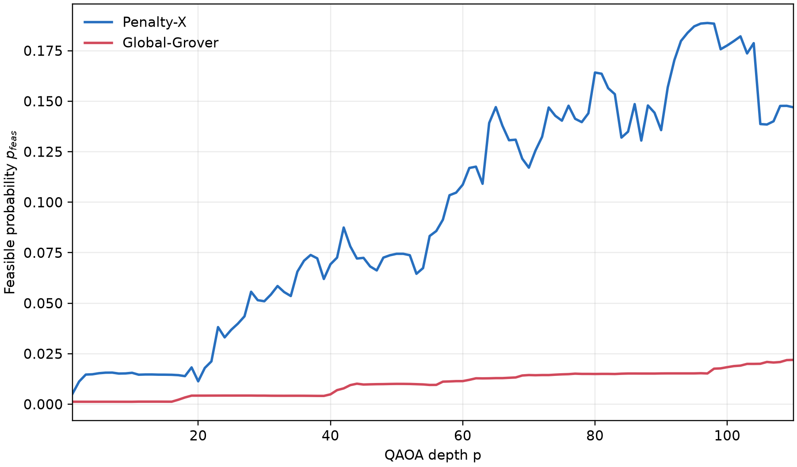

**图 4. (p_{feas}) 对 depth。** Penalty-X 的主要强项是把更多总概率移入 feasible region。

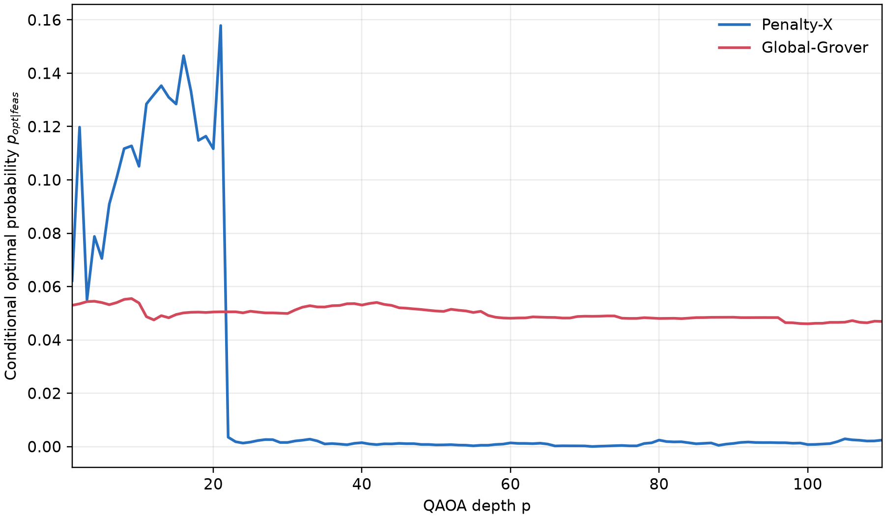

**图 5. (p_{opt\mid feas}) 对 depth。** Global-Grover 的主要相对强项是 feasible component 中更高的 optimum fraction；这与较低的绝对 (p_{feas}) 同时存在。

因此，Penalty-X 与 Global-Grover 不是简单地“一个成功、一个失败”。它们在 distribution factorization 中解决不同部分：Penalty-X 更有效地发现 feasibility；Global-Grover 通常保留更好的 feasible-conditional quality。绝对 (p_{opt}=p_{feas}p_{opt\mid feas}) 由二者共同决定。

> **证据等级：** FROZEN PRIMARY / DESCRIPTIVE（单实例、每个 mixer 一条 deterministic continuation trajectory）  
> **数据来源：** `results/global_depth110/canonical_rows.csv`、`analysis_summary.json`、`near_p100.csv`、`validation_summary.json`  
> **支持的主张：** 该协议下的 best depth、oscillation、p22 crossover、110/110 feasibility ordering、89/110 conditional ordering、未达 0.10  
> **不支持的主张：** global variational optimum、depth scaling law、mixer 普适排名、optimizer-converged ansatz comparison

# 8. 为什么 p=110 没有出现 textbook Grover 跃迁

若在 (N=16,384) 个 states 中只有一个 marked state，标准 Grover search 的理想 iteration scale 为

\[
\frac{\pi}{4}\sqrt{N}\approx100.53.
\]

这只是 exploratory reference，不能直接映射到这里的 QAOA depth。Textbook Grover 使用固定的 binary oracle、固定的 phase inversion/diffusion 结构、已定义 marked set，并可解析选择 iteration count；本项目 full-space Global-Grover 则使用 continuous penalized routing energy phase、每层不同的 variational (gamma_\ell,eta_\ell)、COBYLA 搜索、有限 evaluation budget，以及包含 feasibility penalty 和多能级结构的 landscape。它没有将唯一 optimum 显式标记为 oracle target。

经验上，p90–110 的 Global (p_{opt}) 范围仍为 0.000322769，并有 9 次方向变化；Penalty-X 范围为 0.000267767，有 6 次方向变化。p≈100 附近没有 sharp transition，且所有 (p_{opt}<0.10)。这不反驳 Grover algorithm；它只说明“rank-one Grover-like mixer + variational cost phases + finite-budget optimizer”的 QAOA 不自动继承 textbook Grover 的 iteration law。

更深的 ansatz 还带来更高维 classical search：p110 有 220 个 angles，却只有 504 evaluations。220/220 rows 都是 `BUDGET_LIMITED`。因此该实验无法把 ansatz expressivity 与 classical optimization difficulty 完全分离，也不能从 (p\approx\sqrt{N}) 推出 QAOA depth law。

> **证据等级：** DESCRIPTIVE + THEORETICAL BOUNDARY  
> **数据来源：** `results/global_depth110/near_p100.csv`、`REPORT.md`、`experiment_config.json`  
> **支持的主张：** p≈100 附近无实测 sharp transition，轨迹仍 oscillatory  
> **不支持的主张：** textbook Grover scaling 被否定，或 QAOA 应在 (p\approx\sqrt N) 达峰

# 9. 第一阶段 CVaR Robustness Study

\`results/cvar_robustness_v1\` 是在 pilot 之后冻结的 140-cell fresh-seed study。它把 Penalty-X p110 指定为 confirmatory block，并把 Global-Grover、depth replication、alpha response 与 distribution metrics 指定为 secondary/descriptive evidence。所有 paired objectives 共享初始参数 hash；所有 140 cells 完成且没有 failed cells。

## 9.1 Penalty-X：保留 mixed 结果

| Algorithm / depth | Evidence class | Seeds | E median \(p_{opt}\) | CVaR-.10 median | Wins | Median ratio | Geometric mean | Paired bootstrap 95% interval | Frozen interpretation |
| --- | --- | ---: | ---: | ---: | ---: | ---: | ---: | ---: | --- |
| Penalty-X p110 | Confirmatory | 10 | 0.000055090 | 0.000272666 | 7/10 | 2.971 | 2.766 | [0.613, 9.097] | \`MIXED_CVAR_RECOVERY\` |
| Global-Grover p110 | Descriptive secondary | 10 | 0.000546423 | 0.002263721 | 10/10 | 3.929 | 4.005 | [3.115, 4.910] | reproducible recovery |
| Penalty-X p50 | Depth replication | 5 | 0.00005684 | 0.00004481 | 1/5 | 0.788 | — | — | no recovery |
| Penalty-X p100 | Depth replication | 5 | 0.00002783 | 0.00011726 | 3/5 | 1.260 | — | — | mixed descriptive |
| Global-Grover p50 | Depth replication | 5 | 0.00039107 | 0.00077058 | 5/5 | 2.283 | — | — | directional replication |
| Global-Grover p100 | Depth replication | 5 | 0.00032079 | 0.00142228 | 5/5 | 4.104 | — | — | directional replication |

冻结 robustness rule 要求同时满足至少 8/10 wins 与 median paired ratio≥2。Penalty-X 只通过倍率门槛、未通过 wins 门槛，因此不能写成 robust；7/10 的负向或混合 seeds 也不能因后续新实验更有利而删除。Bootstrap interval 跨 1 进一步显示 effect magnitude 不稳定。正确标签始终是 \`MIXED_CVAR_RECOVERY\`。

## 9.2 Global-Grover：可复现但仍是有限预算

Global-Grover p110 的中位 \(p_{opt}\) 从 0.0005464 提高到 0.0022637，10/10 paired seeds 同方向；p50 和 p100 又分别 5/5 同方向。三种离散 depths 的一致性使“该实例和协议中存在 CVaR recovery”成为有力描述性结论，但这些点不是 scaling series，未拟合也不支持 depth law。

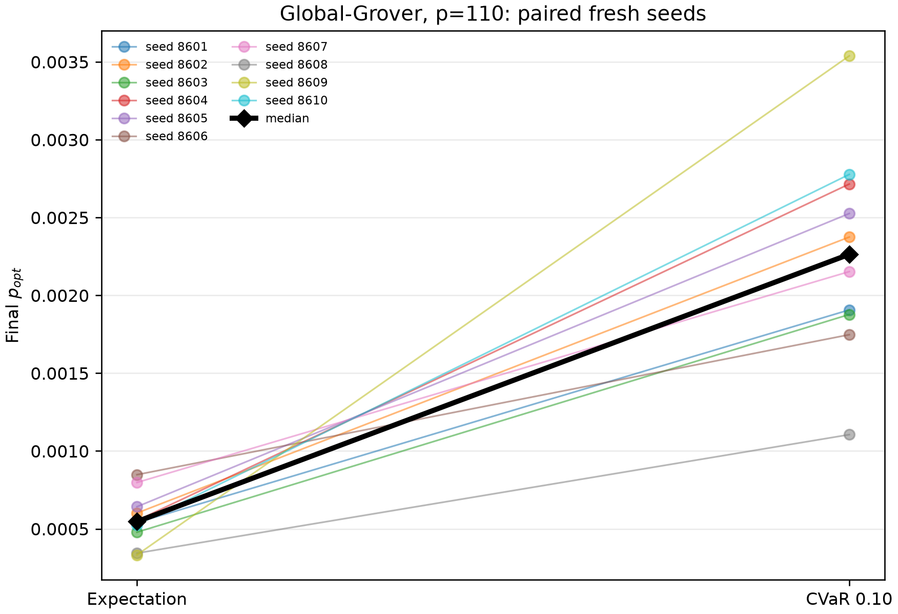

**图 6. 第一阶段 Global-Grover paired result。** 每条配对线均上升，显示 sign consistency；纵轴的绝对量级同时提醒 \(p_{opt}\) 仍很小。

## 9.3 Alpha response：仅为 exploratory best alpha

| Mixer | Expectation / α=1 | α=.50 | α=.25 | α=.10 | α=.05 | Observed best | Evidence status |
| --- | ---: | ---: | ---: | ---: | ---: | --- | --- |
| Penalty-X median \(p_{opt}\) | 0.00005509 | 0.00009303 | 0.00007939 | 0.00027267 | 0.00031860 | α=.05 | \`EXPLORATORY_BEST_ALPHA\` |
| Global-Grover median \(p_{opt}\) | 0.00054642 | 0.00118636 | 0.00130303 | 0.00226372 | 0.00220679 | α=.10 | \`EXPLORATORY_BEST_ALPHA\` |

两种 mixer 的 response 非单调，且 observed best 不同。Global 的 .10 只比 .05 略高，Penalty 的 .05 反而最高。第二研究固定 .10 是为了前瞻性复验既有 Global signal，而不是声称 .10 universally optimal。

## 9.4 第一阶段机制：feasible-region amplification

| CVaR-.10 minus Expectation paired median change, p110 | Penalty-X | Global-Grover |
| --- | ---: | ---: |
| Δ\(p_{opt}\) | +0.00010965 | +0.00158603 |
| Δ\(p_{feas}\) | +0.00380643 | +0.03145508 |
| Δ\(p_{opt\mid feas}\) | -0.00495110 | -0.00231081 |
| ΔTop-3 absolute feasible mass | +0.00060288 | +0.00462470 |
| ΔTop-5 absolute feasible mass | +0.00104573 | +0.00767935 |
| Δlow-energy top-100 mass | +0.00984093 | +0.09214829 |
| Δfull entropy | -0.00268106 | +0.13868030 |
| Δfeasible entropy | +0.0251299 | +0.0009520 |

CVaR 对两种 mixer 都提高了 feasible mass 与 broad low-energy mass，却没有一致提高 \(p_{opt\mid feas}\)，也没有共同降低 feasible entropy。于是 frozen mechanism label 是 \`FEASIBLE_REGION_AMPLIFICATION\`，而不是 \`WITHIN_FEASIBLE_OPTIMAL_CONCENTRATION\`。Entropy 的方向在 mixer 间不同，不能单独作为“更集中所以更好”的代理。

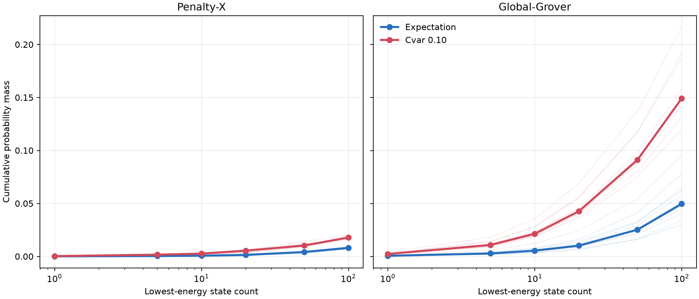

**图 7. 累计低能量 probability mass。** CVaR 的主要分布变化覆盖一片 low-energy states，而不只是一条 optimum route。

> **证据等级：** Penalty-X p110 \`CONFIRMATORY\`；Global p110/depth \`DESCRIPTIVE SECONDARY\`；alpha \`EXPLORATORY\`；distribution analysis \`MECHANISTIC\`  
> **数据来源：** \`results/cvar_robustness_v1/canonical_rows.csv\`、\`paired_seed_comparison.csv\`、\`alpha_response_summary.csv\`、\`depth_replication_summary.csv\`、\`distribution_concentration_summary.csv\`  
> **支持的主张：** Penalty mixed、Global reproducible recovery、first-stage feasible-region amplification  
> **不支持的主张：** robust Penalty recovery、universal α=.10、depth scaling、converged optimum superiority

# 10. 核心疑问：会不会只是 optimizer budget 不够？

第一阶段的关键 caveat 是所有 cells 都耗尽了各深度的 COBYLA budget，且没有一个 early convergence。正确 budget 是：p50 2,500、p100 5,000、p110 5,500；不能笼统写成“全部只有 5,500”。

这产生两种竞争解释。其一，CVaR 在同样有限资源下确实提供更有效的 search control；其二，Expectation 只是需要更多 evaluations，最终可能 catch up。第一阶段只能建立 matched finite-budget effect，不能区分二者。因而第二项 prospective study 不再增添 depth 或 alpha，而把 Global-Grover p110 的单条 optimizer trajectory 延长到 11,000，并在 1,000、2,500、5,500、8,000、11,000 保存同一 trajectory 的 incumbent checkpoints。这使“budget response”成为真正的纵向检验，而不是不同 cells 的后验拼接。

# 11. CVaR Search-Control Mechanism Study

\`results/cvar_search_control_mechanism_v1\` 的 protocol 在任何新 scientific cell 之前冻结。Hamiltonian、graph、decoder、p110 direct 220-angle parameterization、bounds、seed initialization、Expectation/CVaR-.10 语义均保持不变；不加入新 depth、alpha、mixer 或 graph。

| Experiment | 目的 | Cells | Seeds | Optimizer / per-cell cap | Completion |
| --- | --- | ---: | --- | --- | --- |
| A — budget response | Expectation 是否随 budget catch up？ | 20 | 8801–8810 | COBYLA / 11,000 | 20/20 |
| B — optimizer sensitivity | recovery 是否仅为 COBYLA sign artifact？ | 10 | 8801–8805 | Nelder-Mead / 5,500 | 10/10 |
| C — objective switch | basin discovery 还是持续 objective pressure？ | 20 | 8801–8805 | COBYLA restart / +5,500 | 20/20 |
| D — mixer control | Global 与 Penalty 的 transport channel 是否不同？ | 10 | 8801–8805 | COBYLA / 11,000 | 10/10 |
| **Total** | — | **60** | — | **495,000 planned/actual evaluations** | **60/60** |

完整性结果为：failed=0、resource-censored=0、partial=0、duplicate identities=0、missing identities=0；A/B/C/D paired coverage 全部存在。60/60 optimizations 均 \`EVALUATION_BUDGET_EXHAUSTED\`，没有 early convergence。Final independent verification 通过 836/836 checks。冻结 \`cvar_robustness_v1\` 的 312-file inventory byte-for-byte unchanged；报告记录其 canonical inventory digest \`c0bc2821…6dee\`、frozen manifest \`f468f300…6a11\` 和 canonical CSV \`1472b978…710\` 均保持不变。

冻结科学执行报告记录当时的 repository suite 通过 176 tests。本次最终写作又在当前重构后的工作区实际执行 `.venv/bin/python -m pytest -q`，结果为 **167 passed in 56.03 s**；并执行 `.venv/bin/python src/main.py`，成功复现 14 edges、16,384 bitstrings、唯一 cost-10 route 与两种 full-space mixer 的 p=1 baseline。测试数量变化来自当前代码/测试组织状态，不能把两个快照的计数直接相加。软件完整性增加了对 identity、normalization 与 metric recomputation 的信心，但它本身不是 algorithmic superiority 的证据。

> **证据等级：** PROSPECTIVE FROZEN STUDY + INTEGRITY EVIDENCE  
> **数据来源：** \`PROTOCOL.md\`、\`frozen_manifest.json\`、\`execution_plan.md\`、\`canonical_rows.csv\`、\`run_history.json\`、\`verification/final_validation.json\`  
> **支持的主张：** 60-cell study 完整且 paired coverage/历史 preservation 合格  
> **不支持的主张：** 因验证数多而自动获得更强科学效应或跨实例 generality

# 12. Experiment A：Budget Response

每个 seed/objective 只运行一条上限 11,000 的 Global-Grover COBYLA trajectory；表中五个 budgets 是同一 trajectory 的 retained incumbent，不是 100 个独立 cells。以下为 10 fresh paired seeds 的完整 checkpoint summary。

| B | E median \(p_{opt}\) | C median \(p_{opt}\) | Wins | Median paired ratio | Geometric mean | Bootstrap 95% interval | E/C median \(p_{feas}\) | E/C median \(p_{opt\mid feas}\) |
| ---: | ---: | ---: | ---: | ---: | ---: | ---: | ---: | ---: |
| 1,000 | 0.000492783 | 0.001159288 | 10/10 | 2.447 | 2.824 | [2.050, 4.240] | 0.009835 / 0.021620 | 0.048714 / 0.048916 |
| 2,500 | 0.000545849 | 0.001927573 | 10/10 | 3.285 | 3.620 | [2.299, 6.163] | 0.010967 / 0.039716 | 0.047382 / 0.048822 |
| 5,500 | 0.000522336 | 0.002059419 | 10/10 | 3.145 | 3.736 | [2.551, 5.934] | 0.011320 / 0.041500 | 0.046662 / 0.048467 |
| 8,000 | 0.000544049 | 0.002110872 | 10/10 | 2.912 | 3.714 | [2.582, 5.853] | 0.012252 / 0.042374 | 0.045688 / 0.048383 |
| 11,000 | 0.000542156 | 0.002164731 | 10/10 | 2.889 | 3.744 | [2.618, 5.766] | 0.012131 / 0.043388 | 0.045646 / 0.047855 |

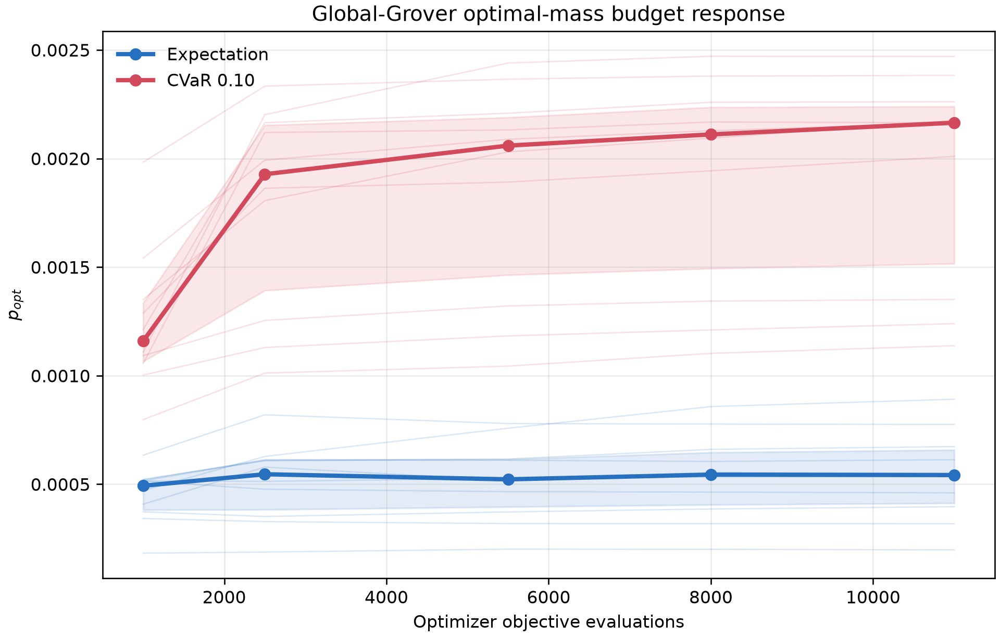

**图 8. Global-Grover \(p_{opt}\) 的 budget response。** CVaR 在所有 ten pairs 和所有 checkpoints 保持正方向；Expectation 中位线在 2,500 后近乎平台。

## Expectation 是否 catch up？

没有。在测试范围内，Expectation median 从 B=1,000 的 0.0004928 仅变到 B=11,000 的 0.0005422；CVaR 从 0.0011593 增至 0.0021647。每个 checkpoint 都满足历史 8/10+2× 规则，B=11,000 endpoint 的 frozen classification 为 \`ROBUST_CVAR_RECOVERY\`；对 budget question 的协议内总结是 \`CVAR_RECOVERY_PERSISTS_WITH_BUDGET\`。

比率 \(R(B)=p_{opt,C}/p_{opt,E}\) 并非单调增加。Median 从 2.447 上升到 3.285，随后缓慢回落至 2.889；geometric mean 从 2.824 上升并稳定在约 3.6–3.74。最准确的描述是：**方向稳定、倍率保持同一量级，但 effect magnitude 对 seed 和 budget 有显著异质性**。B=11,000 个体 paired ratios 约为 1.856–11.007；因此不能把 median 2.889 当成每个 seed 的统一常数。

预算从 5,500 翻倍到 11,000 后 sign 没有减弱到零，故原 5,500 cap 不能解释 recovery；但新 cells 仍全部耗尽 11,000，故“fully converged 后 CVaR 仍优越”仍未建立。

> **证据等级：** B=11,000 \`CONFIRMATORY\`；intermediate checkpoints \`MECHANISTIC/DESCRIPTIVE\`  
> **数据来源：** \`trajectory_checkpoints.csv\`、\`budget_response_summary.csv\`、\`analysis_summary.json\`、figure 01  
> **支持的主张：** \`CVAR_RECOVERY_PERSISTS_WITH_BUDGET\`；Expectation 在测试 budget 内未 catch up  
> **不支持的主张：** \(R(B)\) 单调增长、seed-invariant effect、fully converged superiority

# 13. Experiment B：Optimizer Sensitivity

Experiment B 用完全相同的 five seed-derived initial vectors，在 Nelder-Mead 下比较 E 与 C；COBYLA 对照来自 Experiment A 同 seeds 的 B=5,500 checkpoints。

| Seed | COBYLA E | COBYLA C | C/E | Nelder-Mead E | Nelder-Mead C | C/E |
| ---: | ---: | ---: | ---: | ---: | ---: | ---: |
| 8801 | 0.000372208 | 0.002208510 | 5.934 | 0.000237805 | 0.000538163 | 2.263 |
| 8802 | 0.000779269 | 0.002088433 | 2.680 | 0.000582283 | 0.001029317 | 1.768 |
| 8803 | 0.000757816 | 0.002439668 | 3.219 | 0.000515327 | 0.000776850 | 1.507 |
| 8804 | 0.000318510 | 0.002365232 | 7.426 | 0.000324041 | 0.000827859 | 2.555 |
| 8805 | 0.000615905 | 0.001891448 | 3.071 | 0.000642739 | 0.001121485 | 1.745 |
| **Median / wins** | **0.000615905** | **0.002208510** | **3.219；5/5** | **0.000515327** | **0.000827859** | **1.768；5/5** |

COBYLA 的 geometric-mean ratio=4.106；Nelder-Mead=1.932。两种 optimizer 的方向完全一致，没有 reversal：CVaR 均 5/5 胜。但是冻结 five-seed directional gate 还要求 median ratio≥2，Nelder-Mead 未通过；paired COBYLA-minus-Nelder-Mead log-ratio difference 的中位为 0.759，且 5/5 同方向、超过 \(\log2\)。因此冻结分类是 \`OBJECTIVE_OPTIMIZER_INTERACTION\`。

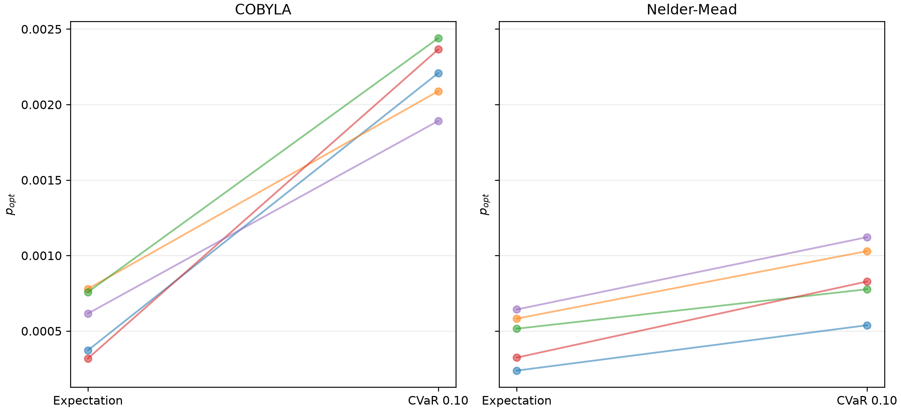

**图 9. COBYLA 与 Nelder-Mead 下的 paired \(p_{opt}\)。** 正方向跨 optimizer 转移，但倍率明显缩小。

**Evaluation efficiency 与 runtime。** 两者都用完 5,500 evaluations，均无 failures/early convergence，因此不能以“谁先收敛”排名。A 的 COBYLA 是一次 11,000-evaluation trajectory 后抽取 5,500 checkpoint，canonical wall time 含完整长轨迹和多 checkpoint overhead；其 11,000-run median wall time 为 472.8 s/cell（约 43.0 s/1,000 evaluations）。Nelder-Mead 5,500-run median 为 85.5 s/cell（15.5 s/1,000）。但 state-evaluation-only 的归一化时间反而相近：约 13.2 vs 13.9 s/1,000。故总 runtime 差主要包含 optimizer Python/native overhead 与 artifact/checkpoint 路径差异，不能简单宣称一种 optimizer 本质更快。

**答案：CVaR recovery 不是 COBYLA-only 的 sign artifact；但也不是 optimizer-independent effect。** 两个 optimizers 只能支持“方向转移、幅度交互”，不能建立 universal optimizer robustness。

> **证据等级：** DESCRIPTIVE SENSITIVITY（5 paired seeds）  
> **数据来源：** \`canonical_rows.csv\`、\`trajectory_checkpoints.csv\`、\`analysis_summary.json\`、figure 05  
> **支持的主张：** \`OBJECTIVE_OPTIMIZER_INTERACTION\`；非 COBYLA-only sign effect  
> **不支持的主张：** optimizer-independent magnitude、optimizer leaderboard、所有 derivative-free optimizers 的 generality

# 14. Experiment C：Objective Switch / Basin Transfer

记号 \(S\to T\) 表示：先取在 source objective \(S\) 下运行 5,500 evaluations 得到的参数，再从同一点重启 COBYLA、继续 5,500 evaluations，以 target objective \(T\) 优化。\(E\) 是 Expectation，\(C\) 是 CVaR-.10。因此 \(C\to E\) 直接测试“CVaR 找到的参数交给 Expectation 后能否保持高 \(p_{opt}\)”；\(E\to C\) 测试“CVaR 能否救回 Expectation 参数”。E→E 与 C→C 是同样 restart semantics 的 controls。

## 14.1 Continuation 前的 cross-evaluation

| Source parameters（5-seed columnwise medians） | \(p_{opt}\) | \(p_{feas}\) | \(p_{opt\mid feas}\) | LowE100 | Expectation value | CVaR-.10 value |
| --- | ---: | ---: | ---: | ---: | ---: | ---: |
| \(\theta_E\) | 0.000615905 | 0.0137305 | 0.0456502 | 0.0574896 | 48.5062 | 21.1618 |
| \(\theta_C\) | 0.002208510 | 0.0449812 | 0.0490985 | 0.1490103 | 67.2432 | 15.2707 |

\(\theta_C\) 在 5/5 seeds 中都有更高 \(p_{opt}\) 和更低（更好）的 CVaR objective，却在 0/5 seeds 中有更好的 Expectation objective。也就是说，高 \(p_{opt}\) 的 CVaR 点不是一个已经被 Expectation 自己评价为更优的 solution。

## 14.2 四个 branches

下表均为 five seeds 的逐列 median；因此“final median − start median”不必精确等于“delta median”。Target change 为对应被优化 objective 的 final-minus-start，负数表示 objective 改善。

| Branch | start→final \(p_{opt}\)（Δ） | start→final \(p_{feas}\)（Δ） | start→final \(p_{opt\mid feas}\)（Δ） | start→final LowE100（Δ） | \|Δθ\|₂ | Target objective start→final（Δ） | Final cross-objective |
| --- | --- | --- | --- | --- | ---: | --- | ---: |
| E→E | .000616→.000623 (+.0000405) | .01373→.01360 (+.000566) | .04565→.04726 (+.000779) | .05749→.06461 (+.00712) | 3.611 | E 48.506→45.566 (−2.940) | C=20.689 |
| E→C | .000616→.002626 (+.002010) | .01373→.04888 (+.03515) | .04565→.04736 (+.001392) | .05749→.13868 (+.08119) | 3.678 | C 21.162→14.841 (−5.861) | E=79.321 |
| C→E | .002209→.001132 (−.000909) | .04498→.02381 (−.01968) | .04910→.05083 (−.001989) | .14901→.10796 (−.04333) | 3.524 | E 67.243→40.569 (−25.869) | C=17.839 |
| C→C | .002209→.002674 (+.000465) | .04498→.05487 (+.00989) | .04910→.04873 (−.000383) | .14901→.18065 (+.02034) | 3.929 | C 15.271→14.329 (−.942) | E=69.847 |

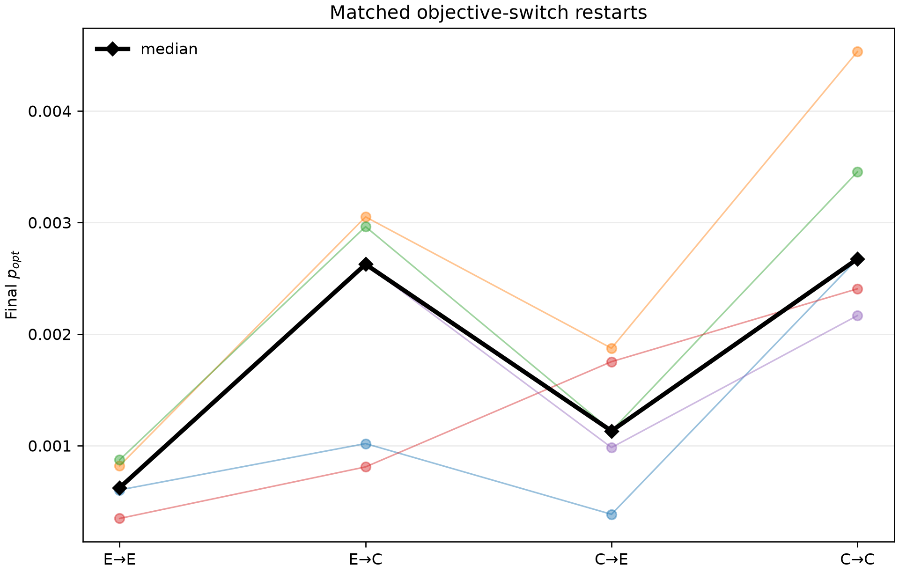

**图 10. 四个 continuation branches 的 \(p_{opt}\)。** 把 target objective 从 C 改为 E 会系统性失去部分最优概率；把 target 改为 C 则从两种 source 都能提高。

### C→E：Expectation 会保留 CVaR 的高 \(p_{opt}\) 吗？

不会完整保留。\(p_{opt}\) 从约 0.002209 降至 0.001132，5/5 seeds 均下降；\(p_{feas}\) 与 LowE100 也显著回落。Expectation 确实把自己的 objective 从 67.24 改善到 40.57，但同时破坏 CVaR 所维持的 distribution。C→E 相对 E→E 仍有 4/5 wins、median ratio 1.578，说明存在有限 residual source/basin memory；但未达到 frozen 2× transfer gate。因此它不是“完全回到普通 E basin”，也不是“好 basin 可无损交接”。

### E→C：CVaR 能 rescue Expectation parameters 吗？

能显著改善。E→C 的 \(p_{opt}\) 从约 0.000616 增至 0.002626，5/5 seeds 改善；E→C/E→E 为 5/5、median ratio 3.395。相对从 CVaR source 继续 C 的 C→C，E→C/C→C median ratio 为 0.673，但只有 3/5 达到 noninferiority ratio≥0.5，未通过 frozen rescue consistency gate。也就是说 CVaR pressure 从较差 E source 也能形成 recovery，但 source history 尚未完全消失。

C→C/C→E 为 5/5、median ratio 2.420；继续使用 C 明显优于从同一 C source 改用 E。按冻结 decision order，结论为 `OBJECTIVE_PRESSURE_REQUIRED`，而不是 `BASIN_DISCOVERY_SUPPORTED` 或 `BIDIRECTIONAL_TRANSFER`。

直观地说，证据更接近：**有利的概率分布需要 CVaR objective 持续推动和维护**，而不是 CVaR 只负责找到一个静态“好 basin”，之后 Expectation 就能同样使用。五 seeds 不能描绘 global landscape topology；结论只约束这些 matched restarts。

> **证据等级：** MECHANISTIC（5 paired restart seeds）  
> **数据来源：** `basin_transfer_rows.csv`、`canonical_rows.csv`、`analysis_summary.json`、figure 06  
> **支持的主张：** `OBJECTIVE_PRESSURE_REQUIRED`；C→E 5/5 decline；E→C 5/5 improvement；有限 residual source memory  
> **不支持的主张：** CVaR 找到 globally superior basin、无 basin effect、完整 landscape topology

# 15. Experiment D：Mixer-Specific Transport

Experiment D 用 seeds 8801–8805 的 Penalty-X 11,000-evaluation trajectories，与 Experiment A 相同五 seeds 的 Global-Grover checkpoints 匹配。首先看 \(p_{opt}\) response。

| B | Global E | Global C | G wins / median ratio | Penalty E | Penalty C | P wins / median ratio |
| ---: | ---: | ---: | ---: | ---: | ---: | ---: |
| 1,000 | 0.000471103 | 0.001287044 | 5/5 / 2.462 | 0.000018025 | 0.000086560 | 4/5 / 6.991 |
| 2,500 | 0.000608086 | 0.002164790 | 5/5 / 3.507 | 0.000044328 | 0.000204031 | 5/5 / 4.603 |
| 5,500 | 0.000615905 | 0.002208510 | 5/5 / 3.219 | 0.000058632 | 0.000328621 | 5/5 / 4.517 |
| 8,000 | 0.000660375 | 0.002258909 | 5/5 / 2.943 | 0.000074189 | 0.000368595 | 5/5 / 4.704 |
| 11,000 | 0.000673172 | 0.002261455 | 5/5 / 2.985 | 0.000074171 | 0.000433821 | 5/5 / 4.822 |

新 Penalty block 明确显示 larger budget 下 recovery：B=11,000 为 5/5、median ratio 4.822。它不能覆盖历史独立十种子的 7/10 `MIXED_CVAR_RECOVERY`；正确更新不是“CVaR 只对 Global 有效”，而是“两个 mixers 都可能受益，但其 seed robustness 与 probability-redistribution signature 不同”。

下表给出每个 budget 的 seed-paired median \(C-E\) changes。

| Mixer / B | Δ\(p_{opt}\) | Δ\(p_{feas}\) | Δ\(p_{opt\mid feas}\) | ΔTop3 | ΔTop5 | ΔLowE100 | ΔH(full) | ΔH(feas) |
| --- | ---: | ---: | ---: | ---: | ---: | ---: | ---: | ---: |
| Global 1k | +.000839 | +.015051 | +.003773 | +.002476 | +.004044 | +.059099 | −.185861 | −.000219 |
| Global 2.5k | +.001574 | +.027044 | +.001391 | +.004457 | +.007340 | +.088379 | +.034470 | +.000245 |
| Global 5.5k | +.001682 | +.028299 | +.001488 | +.004685 | +.007688 | +.086467 | +.102719 | +.000003 |
| Global 8k | +.001613 | +.027411 | +.000804 | +.004499 | +.007385 | +.080500 | +.121498 | −.000141 |
| Global 11k | +.001579 | +.028270 | +.000918 | +.004420 | +.007262 | +.079438 | +.148541 | +.000492 |
| Penalty 1k | +.0000769 | +.000662 | +.037102 | +.0000017 | +.000187 | +.001816 | −.002936 | +.045564 |
| Penalty 2.5k | +.000160 | +.002523 | +.019848 | +.000258 | +.000742 | +.005544 | +.001612 | −.106430 |
| Penalty 5.5k | +.000256 | +.003471 | +.027932 | +.000401 | +.001453 | +.009731 | +.000197 | −.118304 |
| Penalty 8k | +.000319 | +.004007 | +.042440 | +.000570 | +.001809 | +.010997 | −.003703 | −.118892 |
| Penalty 11k | +.000344 | +.004718 | +.040868 | +.000831 | +.001884 | +.011686 | −.002919 | −.113145 |

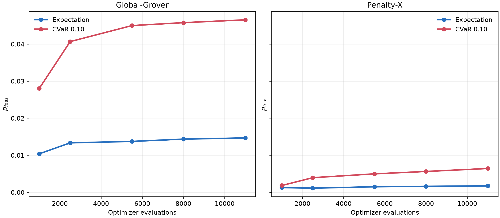

**图 11. CVaR 对 \(p_{feas}\) 的 mixer-matched effect。** Global 的 feasible transport 明显更大。

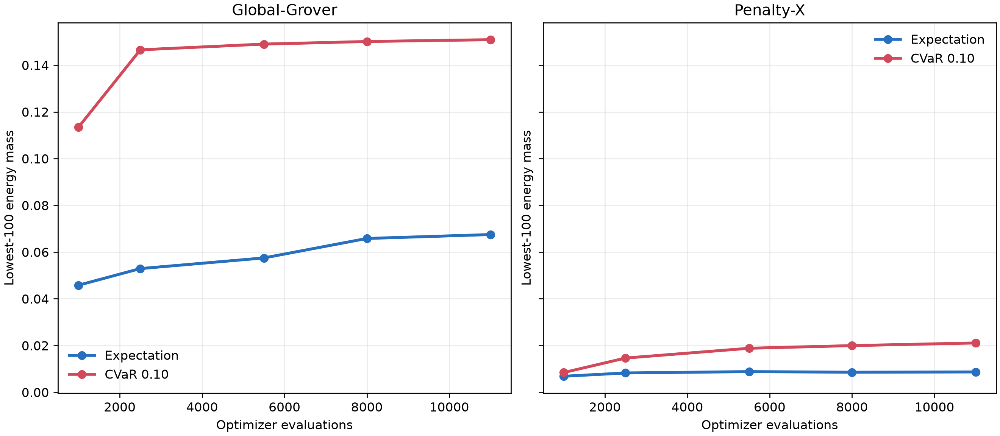

**图 12. CVaR 对 LowE100 的 effect。** Global 的 broad low-energy movement 与 Penalty 的较弱 movement 形成最清楚的分布差异。

B=11,000 时，Global 的 Δ\(p_{feas}=+0.028270\)、ΔLowE100=+0.079438，远高于 Penalty 的 +0.004718、+0.011686；反过来 Penalty 的 Δ\(p_{opt\mid feas}=+0.040868\) 远高于 Global 的 +0.000918。Global 因而表现为 **broad low-energy/feasible-region transport**，Penalty 则表现为 **较弱全局 transport、较强 feasible component 内 conditional sharpening**。Top-3/Top-5 absolute mass 也支持 Global 的绝对输运更大。

所有 frozen transport gates 通过，分类为 `MIXER_SPECIFIC_TRANSPORT_SUPPORTED`。这是一项 matched association：mixer 与 objective 共同改变 distribution channel；它没有隔离并证明“量子 mixer dynamics alone”是唯一原因，classical optimizer trajectory 与 representation 仍参与其中。

> **证据等级：** MECHANISTIC / DESCRIPTIVE（matched 5 seeds）  
> **数据来源：** `trajectory_checkpoints.csv`、`analysis_summary.json`、figures 07–08  
> **支持的主张：** 两 mixers 都可受益；Global transport 更广，Penalty conditional sharpening 更强；`MIXER_SPECIFIC_TRANSPORT_SUPPORTED`  
> **不支持的主张：** Penalty 从不受益、mixer 单独造成 effect、跨 mixer universal ranking

# 16. Mechanism Trajectory

为判断 feasible-region amplification 是 terminal artifact 还是 optimization-process phenomenon，以下比较 matched five-seed Global trajectories 的早期 B=1,000 与终点 B=11,000。数值是各 objective 的 columnwise medians。

| Metric | B1k E | B1k C | B11k E | B11k C | 主要观察 |
| --- | ---: | ---: | ---: | ---: | --- |
| LowE100 | 0.045822 | 0.113479 | 0.067496 | 0.150897 | 最早 checkpoint 已有大幅 C>E |
| \(p_{feas}\) | 0.010391 | 0.028025 | 0.014671 | 0.046528 | 可行区域质量同步增加 |
| \(p_{opt}\) | 0.000471 | 0.001287 | 0.000673 | 0.002261 | ratio 2.462→2.985 |
| \(p_{opt\mid feas}\) | 0.047560 | 0.050951 | 0.045884 | 0.048604 | 差值很小，never qualifies |
| Top-3 absolute mass | 0.001404 | 0.004020 | 0.002111 | 0.007128 | 绝对 good-route mass 增加 |
| Top-5 absolute mass | 0.002337 | 0.006754 | 0.003550 | 0.011825 | 同上 |
| Full entropy | 8.88516 | 8.66292 | 8.58026 | 8.55390 | 方向随 seed/checkpoint 改变，非单一 concentration story |
| Feasible entropy | 2.99341 | 2.99474 | 2.99469 | 2.99429 | 几乎不变，无强 conditional concentration |

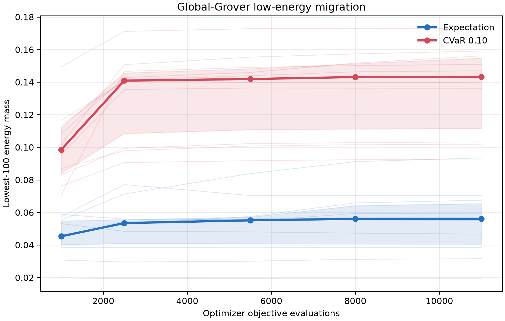

**图 13. LowE100 trajectory。** CVaR 的 low-energy effect 在 B=1,000 前已形成，后续保持而非等待终点才出现。

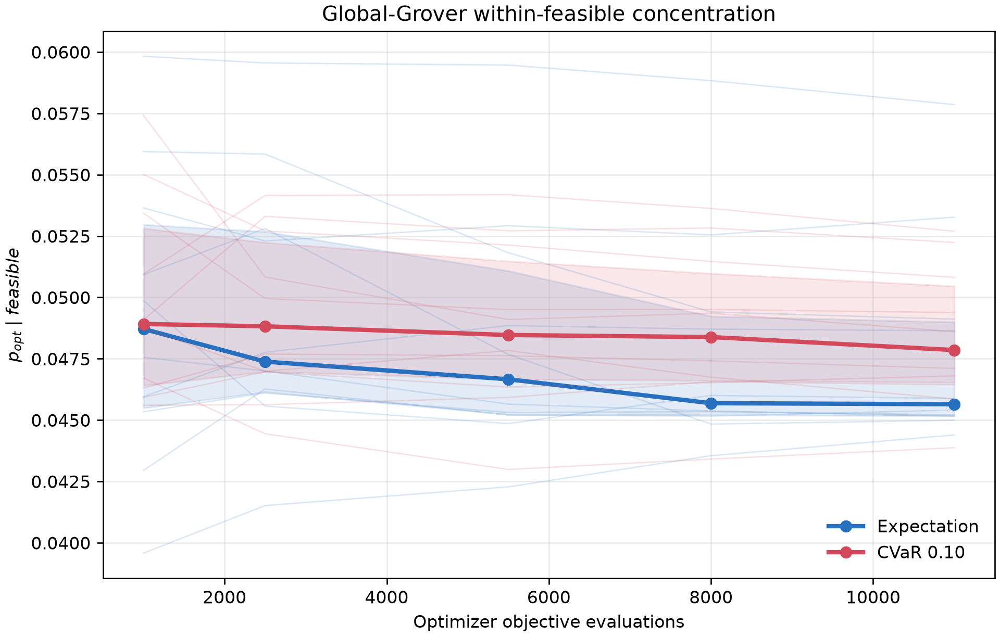

**图 14. \(p_{opt\mid feas}\) trajectory。** 与 LowE100、\(p_{feas}\) 和 \(p_{opt}\) 相比，conditional sharpening 没有达到冻结门槛。

冻结 event rules 要求 LowE100 median change≥0.01、\(p_{feas}\)≥0.005、\(p_{opt}\) 至少 4/5 wins 且 median ratio≥2。三者在第一个 B=1,000 checkpoint 已同时满足：ΔLowE100=+0.05910、Δ\(p_{feas}=+0.01505\)、\(p_{opt}\) ratio=2.462。\(p_{opt\mid feas}\) 要求 median change≥0.005，但在所有 checkpoints 均未通过，B=11,000 只有 +0.000918。

因此 temporal classification 必须是 `SIMULTANEOUS_WITHIN_CHECKPOINT_RESOLUTION`。数据支持三种变化在优化早期已经共同出现，却无法判断 B<1,000 内究竟是 low-energy migration 先于 feasible amplification，还是反之；更不能把下面的逻辑顺序误写成已证 causal timeline。相较第一阶段只观察 terminal distributions，新 trajectory evidence 使 `FEASIBLE_REGION_AMPLIFICATION` 的状态成为 **STRENGTHENED**。

> **证据等级：** MECHANISTIC TRAJECTORY（5 paired seeds；checkpoint resolution=1,000 evaluations 起）  
> **数据来源：** `trajectory_checkpoints.csv`、`analysis_summary.json`、figures 03、04、09  
> **支持的主张：** `FEASIBLE_REGION_AMPLIFICATION: STRENGTHENED`；`SIMULTANEOUS_WITHIN_CHECKPOINT_RESOLUTION`  
> **不支持的主张：** low-energy→feasible→optimum 的严格 temporal/causal ordering

# 17. 最终机制模型

综合 budget、optimizer、switch 和 mixer evidence，最强的受支持机制模型是：

```text
CVaR objective pressure
        ↓
改变 finite-budget classical optimization trajectory
        ↓
更多 probability transport 到 low-energy / feasible regions
        ↓
更高的 absolute p_opt
```

对 Global-Grover，\(p_{opt\mid feas}\) 没有 comparable sharpening，因此 \(p_{opt}=p_{feas}p_{opt\mid feas}\) 的主要增益来自 \(p_{feas}\) 通道。该机制具有四个相互补充的边界：

1. **Budget persistence：** 11,000 evaluations 下仍存在，不由原 5,500 cap 单独解释。
2. **Optimizer interaction：** Nelder-Mead 保留正方向但缩小 magnitude，说明 objective pressure 通过 classical search dynamics 表达。
3. **Objective switch：** C→E 失去 probability mass、E→C 恢复，反对 basin-discovery-only 解释。
4. **Mixer association：** Global 的 low-energy/feasible transport 比 Penalty 更强，而 Penalty 的 conditional sharpening 更强。

因此可支持的是 **objective-pressure-associated probability transport**；未证明的是一个唯一的 causal quantum-dynamics mechanism。既不能把效应归因于 mixer alone，也不能把 optimizer 当作无关的外层组件。项目的中心科学结论正是：QAOA performance 在这里不能只由 depth 理解，mixer、objective 与 classical search control 共同决定 probability mass 移向何处。

# 18. Absolute Performance：相对提升不等于问题解决

## 18.1 B=11,000 final medians

| Mixer / objective | Median \(p_{opt}\) | 百分比 | 直观 \(1/p\) sampling scale | Context |
| --- | ---: | ---: | ---: | --- |
| Global Expectation | 0.000542156 | 0.0542% | 约 1 / 1,844 samples | 10 seeds，A final |
| Global CVaR-.10 | 0.002164731 | 0.2165% | 约 1 / 462 samples | 10 seeds，A final |
| Penalty Expectation | 0.000074171 | 0.00742% | 约 1 / 13,482 samples | 5 seeds，D final |
| Penalty CVaR-.10 | 0.000433821 | 0.0434% | 约 1 / 2,305 samples | 5 seeds，D final |

\(1/p\) 只表示独立同分布理想 samples 中“期望一个 optimal observation”的直观 reciprocal scale；它不是在固定 sample 数内成功的保证，也不包含 hardware/noise effects。即使最佳 median Global-CVaR 相对提升明显，0.2165% 仍是 modest absolute probability。

## 18.2 Best observed retained values

| Method | Best observed \(p_{opt}\) | Seed / optimizer / budget context | Final or best-so-far |
| --- | ---: | --- | --- |
| Global Expectation | 0.001872814 | seed8802；C→E；COBYLA；CVaR source 5,500 + E continuation 5,500 | branch final；约 1/534 |
| Global CVaR-.10 | 0.004531604 | seed8802；C→C；COBYLA；CVaR source 5,500 + C continuation 5,500 | best retained canonical final；0.4532%，约 1/221 |
| Penalty Expectation | 0.000183033 | seed8801；COBYLA；B=1,000 checkpoint | trajectory best-so-far；final-cell maximum为0.000166034 |
| Penalty CVaR-.10 | 0.000731436 | seed8804；COBYLA；B=2,500 checkpoint | trajectory best-so-far；final-cell maximum为0.000601618 |

Global Expectation 的 best retained value 来自 CVaR-discovered source 再切换 objective，不能当作 fresh Expectation-from-random median；Global CVaR best 也只是一个 seed/branch 的最大 retained canonical row，不能替代 paired central tendency。Penalty 的 \(p_{opt}\) 最大 checkpoint 早于 11,000，说明 optimizer 训练 objective 的持续改善不保证 \(p_{opt}\) 单调改善。

结论是：**relative recovery 强，absolute success 仍低。** 本研究刻画 optimization behavior；它没有证明 routing 已被高概率解决，更没有证明 quantum advantage。

> **证据等级：** DESCRIPTIVE ABSOLUTE PERFORMANCE  
> **数据来源：** `trajectory_checkpoints.csv`、`canonical_rows.csv`、`basin_transfer_rows.csv`  
> **支持的主张：** final medians、best retained observed values、低于1%的绝对量级  
> **不支持的主张：** 高成功率、sampling guarantee、best single cell 的 population robustness

<!-- pagebreak -->

# 19. 当前代码架构与端到端执行链

## 19.1 仓库分层

当前仓库不是一份单脚本 demo，而是“教学主链 + 可行域扩展 + 冻结科学实验 + 归档历史控制器”的分层工程。汇报时只需先解释主链，再说明其他目录如何支持可复现性。

| 层次 | 主要路径 | 职责 | 汇报时的定位 |
| --- | --- | --- | --- |
| 问题定义 | `data/graph.json`、`src/graph.py` | 固定图、edge/qubit ordering、路径编码、经典参考路线 | 输入与 ground truth |
| 数学编码 | `src/qubo.py` | 流守恒 residual、QUBO 展开、QUBO→Ising、16,384-state 枚举与 decoder | 公式落到代码的核心 |
| QAOA 主链 | `src/qaoa.py` | cost phase、X/Grover mixer、Expectation/CVaR、COBYLA | 算法核心 |
| 指标 | `src/metrics.py` | `p_feas`、`p_opt`、条件概率、entropy、top-k probability mass | 把量子分布变成路由结论 |
| 最小入口 | `src/main.py` | graph→QUBO→Ising→QAOA→metrics 的短示例 | 演示与答辩首选入口 |
| 可行域扩展 | `src/feasible_qaoa.py`、`src/feasible_experiments.py` | 20-route logical basis、path-exchange、feasible Grover/threshold 方法 | 教学型结构可行性路线 |
| 深度与 CVaR 研究 | `src/global_depth_sweep/` | p1–110、robustness、search-control、analysis、verification | 最终科学证据主线 |
| 命令与图表 | `scripts/`、`figures/` | 薄命令、分析、验证、可视化、报告生成 | 复现与展示层 |
| 冻结证据 | `results/` | canonical rows、configs、distributions、validation、figures | 不应被临时运行覆盖 |
| 历史开发 | `archive/development/` | 旧控制器与设计记录 | provenance，不属于常规 runtime |

当前 Python 源码规模约为 31 个 `src/**/*.py` 文件、12,564 行；测试目录含 16 个文件、1,795 行。代码量本身不是科学贡献，但说明项目已把模型、模拟、优化、分析和验证拆成可检查的模块，而不是把所有逻辑隐藏在 notebook 中。

## 19.2 一次 full-space 实验如何执行

```text
graph.json
   ↓ load_graph / validate_graph
固定 14-edge ordering
   ↓ build_qubo + enumerate_state_space
QUBO diagonal：route cost + 6 × flow penalty
   ↓ qaoa statevector simulator
cost phase → mixer → ... → final probability distribution
   ↓ classical optimizer
Expectation 或 CVaR 返回 loss，更新 2p 个角度
   ↓ route decoder + metrics
p_feas、p_opt、p_opt|feas、feasible cost、entropy、top-k mass
   ↓ canonical row / checkpoint / validation
可分析且可审计的冻结结果
```

这条链中 exact optimum 只在最后评价和一致性检查时使用；训练 loss 只读取 energy distribution。Global-Grover 的 rank-one mixer 通过一次 overlap 与向量加法实现，不构造 16,384×16,384 稠密矩阵。深度研究使用 `src/global_depth_sweep/simulator.py` 的明确 full-space convention；短教学入口 `src/qaoa.py` 还保留早期 course 的 X-mixer `beta/q` convention，因此跨阶段比较必须遵守各自冻结协议。

## 19.3 为什么结果目录被视为证据而不是缓存

每项正式研究都保存 config、canonical rows、原始或最终 distribution、analysis summary、run history 与 validation summary。报告中的主数字优先来自 canonical CSV/JSON，而不是从图片反读。不同 seed block、pilot 与 confirmatory study 保持分层；历史结果树有 hash/preservation 检查。这样做的目的不是制造更多文件，而是让“运行了什么、何时停、哪些 cell 失败、图从哪里来”都能追溯。

# 20. 软件核验与复现指南

## 20.1 本报告使用的完整性证据

| 核验层 | 当前或冻结结果 | 能支持什么 |
| --- | --- | --- |
| 当前 repository test suite | 167 passed，56.03 s（2026-08-19 本地实跑） | 当前重构工作区的 API、编码、目标函数、模拟器与命令测试通过 |
| 当前最小示例 | `src/main.py` 成功；14 edges、16,384 states、route cost=10 | 主链可执行且 reference/metrics 一致 |
| `global_depth110` verification | 43/43 passed | 220 rows、共享问题、概率归一、指标和 artifacts 合格 |
| `cvar_robustness_v1` verification | 43/43 passed | 140 cells、paired coverage、distribution 与历史 preservation 合格 |
| search-control final verification | 836/836 passed，60/60 cells，0 failures | prospective manifest、checkpoint、switch/mixer analysis 与历史树合格 |
| QUBO–Ising exhaustive check | max error=0 over 16,384 states | 两种能量表示在冻结实例上完全一致 |

测试通过说明实现满足已写下的 invariants；它不等于算法优越性证明。反过来，科学结果也必须同时报告 optimizer budget exhausted、single-instance 与 ideal-simulation 等边界。

## 20.2 推荐复现顺序

```bash
# 1. 安装开发依赖
python -m pip install -e ".[dev]"

# 2. 运行完整测试
python -m pytest -q

# 3. 运行不会写结果文件的最小主链
python src/main.py

# 4. 只分析已有冻结结果；不要先重跑长优化
python scripts/analyze_global_depth110.py
python scripts/analyze_cvar_robustness.py
python scripts/analyze_cvar_search_control_mechanism.py
```

深度与 CVaR scientific runners 可能消耗大量时间，并会涉及 checkpoint/result-root 语义。汇报准备阶段应优先读取已保存 canonical evidence，只有在明确的新协议、新目录和资源预算下才启动新实验。

## 20.3 汇报时如何解释两个“看起来冲突”的成功率

20-route logical GM-Th-QAOA 在 p=3 的 median `p_opt=0.998712`，而 full-space Global-Grover CVaR 在 B=11,000 的 median `p_opt=0.0021647`。两者并不矛盾：前者先经典枚举并限制到 20 条可行路线，又使用 incumbent threshold；后者从全部 16,384 个 edge bitstrings 出发，使用连续 penalized energy，且没有 feasible projection 或 marked optimum oracle。它们回答不同问题，不能放在同一排行榜中。

# 21. 结论、局限与下一步

## 21.1 最终结论

1. **编码成立。** 14 个 edge bits、流守恒 QUBO 与 Ising diagonal 在全部 16,384 个 basis states 上一致；唯一 ground state 对应 cost-10 最短路线。
2. **Cost 与 mixer 分工明确。** Cost layer 只把 energy 写入相对相位；mixer 通过干涉改变概率。因此 QAOA 的性能不能只看 Hamiltonian，还要看 mixer geometry。
3. **深度不是单独的答案。** p1–110 轨迹高度非单调；Penalty-X 的观测峰值在 p=21，Global-Grover 在 p=110，均没有出现 textbook Grover 式跃迁。
4. **CVaR recovery 在 Global-Grover 上具有稳定方向。** B=11,000 时 10/10 fresh pairs 获胜，median `p_opt` 从 0.000542 提高到 0.002165；方向跨 Nelder-Mead 保留，但倍率与 optimizer 交互。
5. **主要机制是 probability transport。** Global-Grover 的 CVaR 增益主要来自更多 probability 进入 low-energy/feasible region，而不是同等强度的 feasible 内部 sharpening；Penalty-X 更偏向 conditional sharpening。
6. **结构可行域方法展示了上限，也暴露了代价。** 在预枚举 20-route basis 中，GM-Th p=3 可达 0.998712 median `p_opt`，但该强结果依赖 classical enumeration、logical operators 与 threshold construction，不能作为 scalable hardware claim。

一句话总结：**在这个固定路由实例上，QAOA 的最终概率分布由 representation、mixer、objective、depth 与 classical search control 共同决定；增加深度本身不足以解释或保证成功。**

## 21.2 主要局限

- 只有一个 7-node、14-edge DAG 实例，无法建立跨图 generality 或 scaling law。
- 所有主结果来自 ideal complex128 statevector，没有 QPU、gate noise、finite-shot estimation 或 error mitigation。
- full-space p=110 有 220 个角度且所有正式 cells 均受有限 evaluation budget 约束；没有 fully converged global optimum 证据。
- feasible-subspace 方法先枚举全部 20 条路线；这一预处理在一般图上最坏可指数增长。
- Global-Grover rank-one update 是高层线性代数模拟，报告未给出低深度物理门编译与 state-preparation 资源。
- fresh seed 数量为 5 或 10 的 paired blocks；bootstrap interval 描述该协议内不确定性，不等于总体普适统计保证。
- `p_opt` 的相对倍率可很大，但 full-space absolute probability 仍低于 1%。

## 21.3 最有价值的后续工作

1. 在多类图规模、密度、最短路退化度和 penalty gap 上做预注册 benchmark，保持训练预算与 seed policy 可比。
2. 用 constraint-preserving edge mixers 或可编译 oracle，避免完整 simple-route enumeration。
3. 把 Global/feasible projector mixer 和 threshold phase 分解为明确 gate circuits，报告 ancilla、two-qubit gates、depth 与 state-preparation cost。
4. 加入 finite shots、噪声模型和 hardware-aware objective，测试 CVaR tail estimate 的方差与 bias。
5. 研究参数迁移、Fourier parameterization、multi-start 与 gradient-based optimizer，但要把 optimizer evaluations、wall time 和 selection rule 一起冻结。
6. 把 `p_opt=p_feas×p_opt|feas` 作为跨实例诊断框架，区分“找到可行域”和“在可行域中选最优”两个通道。

# 22. 15 分钟汇报方案

## 22.1 开场先说这句话

> 本项目不是用量子算法击败 Dijkstra，而是借一个可完全穷举验证的小型路由实例，研究 QUBO 编码、mixer 几何、CVaR 目标和经典 optimizer 如何共同改变 QAOA 的概率分布。

## 22.2 时间、图和口播重点

| 时间 | 页面/图 | 讲什么 | 必须说出的结论 |
| --- | --- | --- | --- |
| 0:00–1:30 | 图 1：路由图 | 7 nodes、14 edges、source 0、target 6、唯一 cost-10 route | 目标是机制研究，不是经典最短路竞赛 |
| 1:30–3:30 | 图 2：pipeline | edge bit、flow residual、QUBO、`x=(1-Z)/2` | 16,384 states 中只有 20 个 decoder-valid routes |
| 3:30–5:30 | QAOA 公式 | cost phase 与 mixer 的作用 | cost 写相位，mixer 把相位差变成概率 |
| 5:30–7:00 | 方法表 | Penalty-X、full Global-Grover、20-route feasible methods | 表示空间不同的结果不能直接排名 |
| 7:00–9:00 | 深度图 3–5 | p1–110 的 `p_opt`、`p_feas`、条件概率 | 深度轨迹非单调，没有 textbook Grover 跃迁 |
| 9:00–11:00 | 图 8：budget response | Global CVaR 在 B1k–B11k 的 paired result | B11k 10/10；median ratio 2.889；绝对值仍仅 0.2165% |
| 11:00–13:00 | 图 9–14 | optimizer、objective switch、mixer transport | 效应需要 objective pressure，且通过 low-energy/feasible transport 表达 |
| 13:00–14:00 | architecture/validation 表 | 175 tests、43/43、43/43、836/836 | 可复现性强，但测试数不等于科学优势 |
| 14:00–15:00 | 结论与局限 | 六条最终结论、single instance、ideal simulator | representation+mixer+objective+optimizer 共同决定结果 |

## 22.3 建议记住的六个数字

| 数字 | 含义 |
| ---: | --- |
| 14 | edge variables / qubits |
| 16,384 | full computational-basis states |
| 20 | decoder-valid simple routes |
| 10 | 唯一最优路线 cost |
| 2.889× | B=11,000 时 Global-CVaR/Expectation median paired ratio |
| 0.2165% | 同一结果的 absolute median `p_opt`，防止只讲相对倍率 |

可行域 GM-Th 的 99.8712% 可以作为扩展结果单独展示，但必须立刻补一句“它发生在预枚举 20-route logical space，不与 16,384-state full-space 结果直接排名”。

## 22.4 结束句

> 我们最重要的发现不是“某个 mixer 永远更好”，而是 QAOA 的概率从哪里来、往哪里去，取决于约束表示、mixer 几何、训练 objective 和 classical search trajectory 的共同作用；在这个实例上，CVaR 的主要作用是把概率推入 low-energy 与 feasible region。

# 23. 答辩高频问题与简答

## 23.1 为什么不用 Dijkstra？

如果目标只是求这个实例的最短路，Dijkstra 更直接。这里选择 routing 是因为答案可经典核验，适合研究 QUBO、QAOA 与 probability dynamics；没有量子优势主张。

## 23.2 A=6 有理论保证吗？

没有任意图上的通用保证。A=6 是固定课程配置，并在全部 16,384 个 states 上验证：最优 feasible energy=10、最低 infeasible energy=12，所以本实例 ground state 正确。

## 23.3 为什么 cost layer 本身不让好解概率变大？

它只乘单位模长相位 `exp(-i gamma E_x)`，因此每个 basis amplitude 的模长不变。概率重分配发生在后续 mixer 把不同相位的振幅线性组合时。

## 23.4 这里的 Global-Grover 是标准 Grover search 吗？

不是。它使用连续 penalized cost phase 与 full-space rank-one projector mixer，没有 binary marked oracle，也没有提前知道最优 state；名称只描述 diffusion-like mixer geometry。

## 23.5 为什么 p≈sqrt(16,384) 没出现跃迁？

textbook Grover 的 `O(sqrt(N))` 依赖 uniform initialization、binary oracle 和特定 diffusion iteration。本项目使用连续 energy、变分角度、COBYLA 和 layerwise continuation，所以 p 不是标准 Grover iteration count。

## 23.6 CVaR 为什么可能比 Expectation 提高 p_opt？

Expectation 受完整分布影响；CVaR 只对最低能量 alpha probability mass 施压。在本实例中，这改变了 finite-budget optimizer trajectory，把更多概率推入 low-energy 和 feasible regions。

## 23.7 会不会只是原来的 optimizer budget 太小？

在测试范围内不是单由原 5,500 cap 造成：budget 翻到 11,000 后 Global-CVaR 仍 10/10 胜。但所有新 cells 也耗尽预算，所以仍不能声称 fully converged superiority。

## 23.8 CVaR 是否只找到了一个好 basin？

证据更支持持续 objective pressure。C→E 在 5/5 seeds 上降低 `p_opt`，E→C 在 5/5 上提高；说明切回 Expectation 会损失一部分由 CVaR 维持的 distribution。

## 23.9 99.87% 和 0.2165% 为什么差这么大？

99.87% 来自预枚举的 20-route logical feasible space 和 incumbent-threshold phase；0.2165% 来自全部 16,384 states 的 continuous penalized full-space study。搜索支撑、初始 baseline 和 phase semantics 都不同。

## 23.10 结果能上真实量子硬件吗？

当前报告不能这样宣称。全空间 statevector 与逻辑 projector 都是高层理想模拟；真实实现还需要 state preparation、oracle/projector 分解、two-qubit gate count、noise 与 finite-shot 分析。

## 23.11 项目最大的贡献是什么？

不是取得高绝对成功率，而是通过深度 sweep、fresh paired seeds、budget response、optimizer sensitivity、objective switch 和 distribution metrics，把 depth、mixer、objective 与 classical search control 的作用拆开。

## 23.12 下一步先做什么？

优先在多实例上预注册复现 full-space CVaR transport 结论，并同时设计可编译的 constraint-preserving mixer；否则无法判断当前机制是实例特例还是可扩展现象。

# 24. 参考文献与仓库证据入口

## 24.1 方法背景

- E. Farhi, J. Goldstone, S. Gutmann, *A Quantum Approximate Optimization Algorithm*, arXiv:1411.4028。
- A. Bartschi, S. Eidenbenz, *Grover Mixers for QAOA: Shifting Complexity from Mixer Design to State Preparation*, arXiv:2006.00354。
- J. Golden, A. Bartschi, D. O'Malley, S. Eidenbenz, *Threshold-Based Quantum Optimization*, arXiv:2106.13860。
- D. Feeney, R. Tate, S. Eidenbenz, *The Better Solution Probability Metric: Optimizing QAOA to Outperform its Warm-Start Solution*, arXiv:2409.09012。
