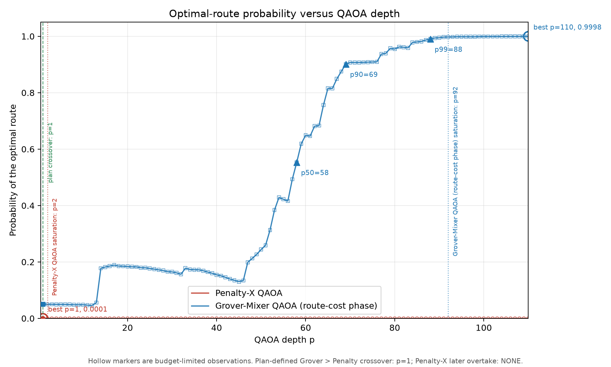
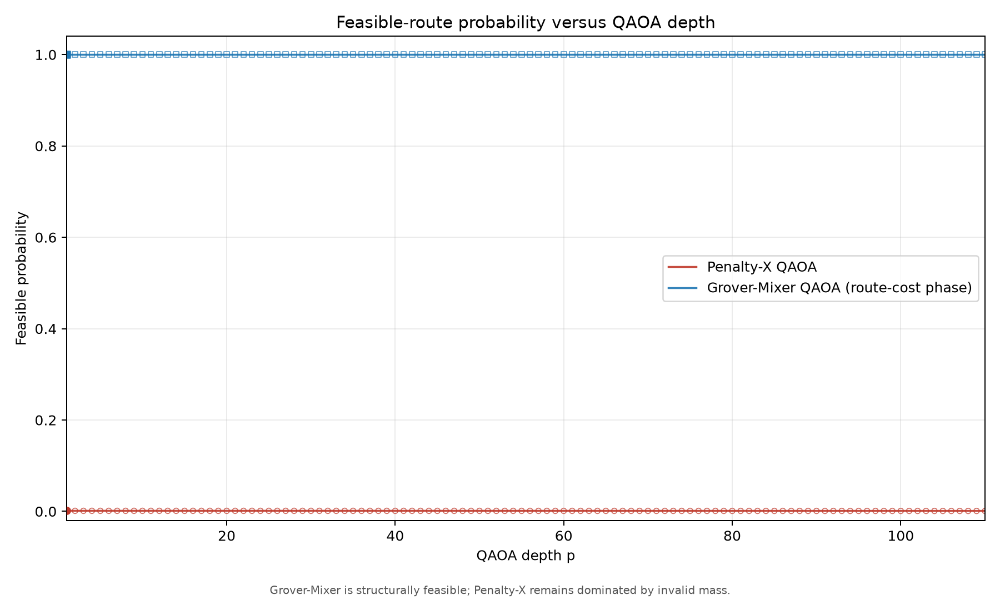
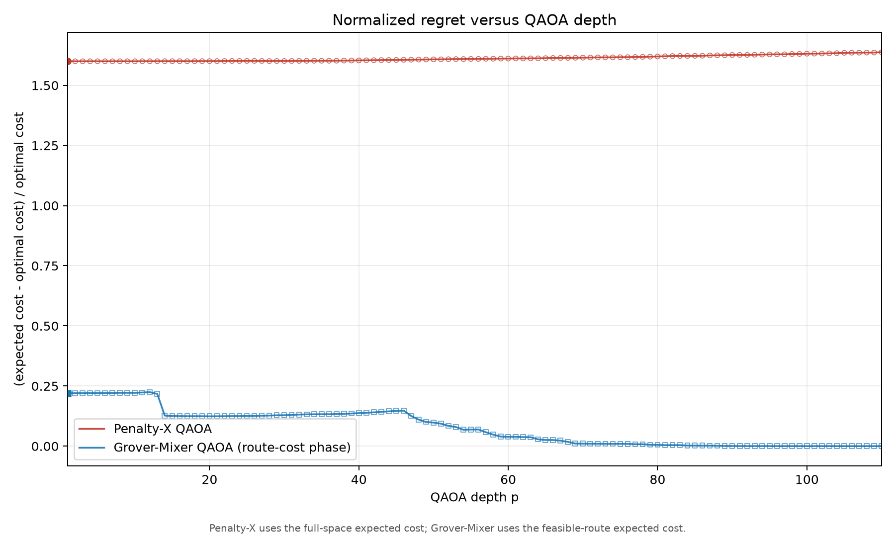

# Depth-110 QAOA Main Track

## Research question

This study compares Penalty-X QAOA with a feasible-subspace Grover-Mixer QAOA on the fixed course routing instance for every depth from p=1 to p=110.

The Grover cost layer follows the route-cost operator used in the project plan:

\[H_C^G=\sum_i C(P_i)|P_i\rangle\langle P_i|,\qquad U_C(\gamma)|P_i\rangle=e^{-i\gamma C(P_i)}|P_i\rangle.\]

The incumbent-threshold mask is used only to calculate the auxiliary better-solution probability (BSP). It is not used in the QAOA evolution.

## Frozen protocol

- Depths: p=1,...,110 for both algorithms (220 canonical rows).
- Base seed: 2601; depth RNG seed: `base_seed + 7919 * p`.
- Classical optimizer: COBYLA with layerwise continuation.
- Function-evaluation budget: `80 + 1.5 * (2p), clamped to [60, 400]`.
- Penalty-X rows retained unchanged: 110.
- Route-cost Grover-Mixer rows optimized for this main track: 110.
- An exhausted function-evaluation budget is labelled **BUDGET_LIMITED**. It is not reported as a wall-clock timeout or a crash.

## Main results

| Metric | Penalty-X | Route-cost Grover-Mixer |
| --- | ---: | ---: |
| best depth | 1 | 110 |
| best p_opt | 0.000061 | 0.999846 |
| first p_opt >= 0.50 | NOT REACHED | 58 |
| first p_opt >= 0.90 | NOT REACHED | 69 |
| first p_opt >= 0.99 | NOT REACHED | 88 |
| observed saturation-criterion onset | 2 | 92 |
| p=110 p_opt | 0.000049 | 0.999846 |
| p=110 p_feas | 0.000988 | 1.000000 |
| optimizer wall time | 3232.79 s | 297.54 s |
| budget-limited rows | 109 | 109 |

The plan-defined crossover, the first depth at which Grover-Mixer has higher p_opt than Penalty-X, is: **1**.
The first later depth at which Penalty-X overtakes the Grover-Mixer is: **NOT REACHED** over the saved depth range.

Saturation follows the pre-registered definition: the onset is the first depth p for which L=10 consecutive changes satisfy |p_opt(k)-p_opt(k-1)| < 1e-3 for k=p,...,p+L-1. Under this definition, the saved trajectories give observed criterion onsets p_sat=2 for Penalty-X and p_sat=92 for the route-cost Grover-Mixer under the frozen optimization budget. The Penalty-X value indicates no measurable early improvement; it is not evidence of successful convergence at p=2.

## Figures



Figure 1 shows optimal-route probability. Hollow markers are budget-limited observations retained as end-to-end results. The plot marks p50, p90, p99, both saturation-criterion onsets, the best observed depths, and the plan-defined crossover at p=1. Penalty-X never overtakes the Grover-Mixer over p=1,...,110.



Figure 2 shows feasible-route probability. The Grover-Mixer has p_feas=1 because its state is constructed in the 20-route feasible subspace. This is a structural property of the representation, not evidence of quantum advantage.



Figure 3 shows normalized regret. Penalty-X uses the expected cost over the full bitstring space, while the Grover-Mixer uses the expected cost over the 20 feasible routes. The two curves must therefore be interpreted together with feasibility and invalid probability mass.

## Interpretation and limitations

- The route-cost Grover-Mixer remains structurally feasible and reaches p_opt=0.50, 0.90, and 0.99 at depths 58, 69, and 88, respectively.
- Penalty-X remains dominated by invalid probability mass under this frozen protocol.
- The 218 budget-limited rows are observed results under a fixed evaluation cap. They do not separate ansatz expressivity from classical optimization difficulty.
- This is an ideal statevector/logical-subspace simulation on one small instance.
- The study does not claim quantum advantage, hardware performance, or scalable routing.

## Rebuild the analysis from saved data

These commands recalculate the summary, regenerate the three figures, rebuild this report, and validate all saved artifacts without rerunning optimization:

```powershell
python scripts/make_depth_sweep_v2_figures.py
python scripts/make_depth_sweep_v2_report.py
python scripts/verify_depth_sweep_v2.py
```

To rerun only the route-cost Grover trajectory in a new result directory:

```powershell
python scripts/run_cost_phase_grover_sweep.py --max-depth 110 --result-root results/depth110_ext/new_grover_run
```

For a full repository-level reproduction in new directories, first generate the Penalty-X source rows, then the route-cost Grover rows, and finally build a new 220-row main track. The two source runners write only the two algorithms used in the main comparison.

```powershell
python src/depth_sweep.py --max-depth 110 --result-root results/depth110_ext/reproduction_penalty
python scripts/run_cost_phase_grover_sweep.py --max-depth 110 --result-root results/depth110_ext/reproduction_grover
python scripts/build_depth110_v2.py --penalty-root results/depth110_ext/reproduction_penalty --cost-phase-root results/depth110_ext/reproduction_grover --v2-root results/depth110_ext/reproduction_main
```

This full rerun is computationally expensive. It is not required to rebuild the figures, report, or validation checks from the saved v2 artifacts.
